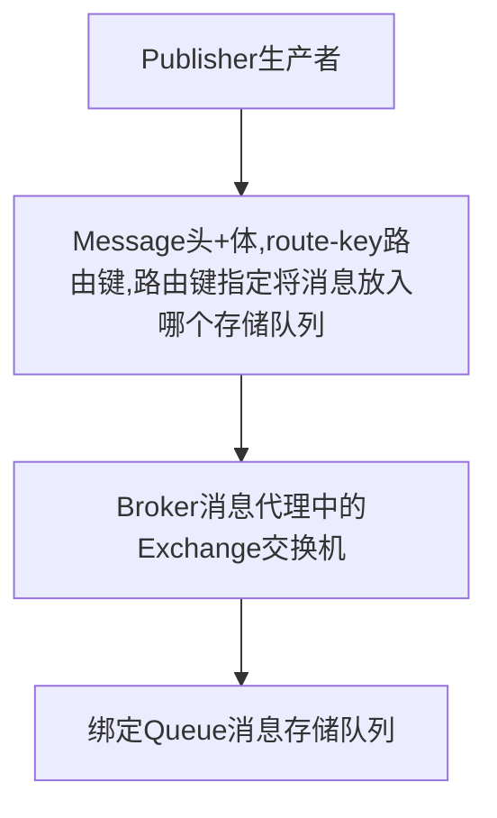

## 消息队列RabbitMQ

- 消息队列的作用
  - 异步处理
  - 应用解耦
  - 流量控制
- **重要概念**
  - 消息代理 (message broker)
  - 目的地 (destination)
    - 队列 (queue) : 点对点消息通信
      - 消息发送者发送消息消息代理将其放进一个队列中，消息接收者从队列中获取消息内容，消息读取后移除队列
      - 消息只有一个唯一的发送者和接收者，但不是说只能有一个接收者
    - 主题 (topic) : 发布/订阅 消息通信
      - 发送者发送消息到主题，多个接收者监听主题，消息到达时接收者同时收到消息
  - 规范
    - JMS(java messsage service) java 消息服务：基于jvm消息代理的规范
    - AMQP（advanced message queuing protocol）高级消息队列协议，兼容JMS 

**RabbitMQ概念**

- Messsage ： 消息是不具名的，由消息头和消息体组成，消息体是不透明的，消息头由可选的属性组成
- Publisher： 消息的生产者，也就是向消息中间件发布消息的服务
- Exchange：交换器，用来接受生产者发送的消息并将这些消息路由给服务器中的队列

**RabbitMQ消息发布模型**



**RabbitMQ消息消费者模型**

一个客户端只会建立一条连接

客户端通过Channel与Broker建立连接,一个Connection会有很多Channel

**RabbitMQ安装**

```bash
docker run -it --rm --name rabbitmq -p 5672:5672 -p 15672:15672 rabbitmq:3.9-management
```

**SpringBoot集成AMQP使用RabbitMQ**

- 依赖

  ```xml
  <dependency>
      <groupId>org.springframework.boot</groupId>
      <artifactId>spring-boot-starter-amqp</artifactId>
  </dependency>
  ```

- 将依赖导入后就自动配置了

  ```
  RabbitConnectionFactoryBean //连接工厂
  RabbitMessagingTemplate
  amqpAdmin
  rabbitTemplate
  ```

- 给配置文件中配置 host和port和虚拟host，并且使用注解`@EnableRabbit`标记主类

  ```yaml
  spring：
  	rabbitmq:
      	host: 192.168.23.182
  	    port: 5672
      	virtual-host: /
  ```

- 创建交换机

  ```java
  @Autowired
      AmqpAdmin amqpAdmin;
  
      @Test
      void contextLoads() {
          DirectExchange directExchange = new DirectExchange("hello-java-exchange", true, false);
          amqpAdmin.declareExchange(directExchange);
          log.info("exchange [{}] create success", "hello-java-exchange");
  
      }
  ```

- 创建队列

  ```java
  @Test
  void createQueue() {
      Queue queue = new Queue("hello-java-queue", true, false, false);
      amqpAdmin.declareQueue(queue);
      log.info("create queue [{}]success", "hello-java-queue");
  
  }
  ```

- 交换机和队列绑定：exchange指定的交换机与destination目的地进行绑定，使用 routingKey作为路由键

  ```java
   @Test
      void createBinding() {
          Binding binding = new Binding("hello-java-queue", Binding.DestinationType.QUEUE,
                  "hello-java-exchange","hello.key",null);
          amqpAdmin.declareBinding(binding);
          log.info("交换机 {} 与队列 {} 绑定成功","hello-java-exchange","hello-java-queue");
      }
  ```

- 向消息队列发送消息

  ```java
      @Autowired
      RabbitTemplate rabbitTemplate;

      /**
       * 测试发送消息
       * 第一个参数为交换机名字
       * 第二个参数为路由键
       * 第三个参数为消息内容
       */
      @Test
      void sendMessageTest() {
          string = "hello world";
          //发送对象 如果发送的消息是一个对象，会使用序列化机制
          OrderReturnReasonEntity orderReturnReasonEntity = new OrderReturnReasonEntity();
          orderReturnReasonEntity.setId(1L);
          orderReturnReasonEntity.setCreateTime(new Date());
          orderReturnReasonEntity.setName("hahahahah");
          rabbitTemplate.convertAndSend("hello-java-exchange", "hello.key",
                  orderReturnReasonEntity);
          log.info("发送消息{} 成功", orderReturnReasonEntity);
      }
  //最后的结果
  /*rO0ABXNyAEBjb20ucGhjLnBoY3N0b3JlLnN0b3Jlb3JkZXIub3JkZXIuZW50aXR5Lk9yZGVyUmV0dXJuUmVhc29uRW50aXR5AAAAAAAAAAECAAVMAApjcmVh
  dGVUaW1ldAAQTGphdmEvdXRpbC9EYXRlO0wAAmlkdAAQTGphdmEvbGFuZy9Mb25nO0wABG5hbWV0ABJMamF2YS9sYW5nL1N0cmluZztMAARzb3J0dAATTGph
  dmEvbGFuZy9JbnRlZ2VyO0wABnN0YXR1c3EAfgAEeHBzcgAOamF2YS51dGlsLkRhdGVoaoEBS1l0GQMAAHhwdwgAAAF7Lr+OdHhzcgAOamF2YS5sYW5nLkxv
  bmc7i+SQzI8j3wIAAUoABXZhbHVleHIAEGphdmEubGFuZy5OdW1iZXKGrJUdC5TgiwIAAHhwAAAAAAAAAAF0AAloYWhhaGFoYWhwcA==
  */
  ```
  
  - 如果需要实现发送json消息，编写配置类
  
    ```java
    @Configuration
    public class MyRabbitConfig {
        @Bean
        public MessageConverter messageConverter() {
            return new Jackson2JsonMessageConverter();
        }
    }
    //最后的结果为
    //{"id":1,"name":"hahahahah","sort":null,"status":null,"createTime":1628577383709}
    ```
  
- 基础使用：从消息队列接收消息：使用` @RabbitListener`注解 

  ```java
      import com.rabbitmq.client.Channel;
  	import org.springframework.amqp.core.Message;
  
  	@RabbitListener(queues = {"hello-java-queue"})
      public void receiveMessage1(Message message,
                                  OrderReturnReasonEntity content,
                                  Channel channel) {
  
          log.info("receiveMessage 1监听到的消息为{} ", content);
      }
  ```

- 进阶使用-1 ` @RabbitListener 标记在类上，说明要监听那些队列 @RabbitHandler 标记在方法上，重载区分不同的消息` 

  ```java
  package com.phc.phcstore.storeorder.order.service.impl;
  
  import com.baomidou.mybatisplus.core.conditions.query.QueryWrapper;
  import com.baomidou.mybatisplus.core.metadata.IPage;
  import com.baomidou.mybatisplus.extension.service.impl.ServiceImpl;
  import com.phc.phcbstort.common.utils.PageUtils;
  import com.phc.phcbstort.common.utils.Query;
  import com.phc.phcstore.storeorder.order.dao.OrderItemDao;
  import com.phc.phcstore.storeorder.order.entity.OrderEntity;
  import com.phc.phcstore.storeorder.order.entity.OrderItemEntity;
  import com.phc.phcstore.storeorder.order.entity.OrderReturnReasonEntity;
  import com.phc.phcstore.storeorder.order.service.OrderItemService;
  import lombok.extern.slf4j.Slf4j;
  import org.springframework.amqp.rabbit.annotation.RabbitHandler;
  import org.springframework.amqp.rabbit.annotation.RabbitListener;
  import org.springframework.stereotype.Service;
  
  import java.util.Map;
  
  
  @Service("orderItemService")
  @Slf4j
  @RabbitListener(queues = {"hello-java-queue"})
  public class OrderItemServiceImpl extends ServiceImpl<OrderItemDao, OrderItemEntity> implements OrderItemService {
  
      @Override
      public PageUtils queryPage(Map<String, Object> params) {
          IPage<OrderItemEntity> page = this.page(
                  new Query<OrderItemEntity>().getPage(params),
                  new QueryWrapper<OrderItemEntity>()
          );
  
          return new PageUtils(page);
      }
  
      /**
       * queue：声明需要监听的所有队列
       * 方法参数可以写一下类型
       * 1. Message message 原生消息详细信息
       * 2. T<发送的消息类型> OrderReturnReasonEntity content
       * 3. Channel 当前传输数据的通道
       * <p>
       * queue： 很多人都可以来监听，只要收到消息，队列删除消息，只能有一个接受到消息
       * 1） 订单服务启动多个
       * 2） 只有一个消息完全处理完才能接受下一个消息
       * <p>
       * 最后的使用
       *
       * @RabbitListener 标记在类上，说明要监听那些队列
       * @@RabbitHandler 标记在方法上，重载区分不同的消息
       */
      @RabbitHandler
      public void receiveMessage1(OrderReturnReasonEntity content) {
          log.info("receiveMessage 1监听到的消息为{} ", content);
      }
  
      @RabbitHandler
      public void receiveMessage2(OrderEntity content) {
          log.info("receiveMessage 2监听到的消息为{}", content);
      }
  }
  ```

- 进阶使用-2 消息发送

  ```java
  package com.phc.phcstore.storeorder.order.controller;
  
  import com.phc.phcstore.storeorder.order.entity.OrderEntity;
  import com.phc.phcstore.storeorder.order.entity.OrderReturnReasonEntity;
  import lombok.extern.slf4j.Slf4j;
  import org.springframework.amqp.rabbit.core.RabbitTemplate;
  import org.springframework.beans.factory.annotation.Autowired;
  import org.springframework.web.bind.annotation.GetMapping;
  import org.springframework.web.bind.annotation.RequestParam;
  import org.springframework.web.bind.annotation.RestController;
  
  import java.util.Date;
  
  @RestController
  @Slf4j
  public class TestRabbitMQController {
  
      @Autowired
      RabbitTemplate rabbitTemplate;
  
      @GetMapping("/sendMsg")
      public String test(@RequestParam(value = "num", defaultValue = "10") Integer num) {
          for (int i = 0; i < num; i++) {
              if (i % 2 == 0) {
                  OrderReturnReasonEntity orderReturnReasonEntity = new OrderReturnReasonEntity();
                  orderReturnReasonEntity.setId(1L);
                  orderReturnReasonEntity.setCreateTime(new Date());
                  orderReturnReasonEntity.setName("偶数");
                  rabbitTemplate.convertAndSend("hello-java-exchange", "hello.key",
                          orderReturnReasonEntity);
                  log.info("发送消息{} 成功", orderReturnReasonEntity);
              } else {
                  OrderEntity orderEntity = new OrderEntity();
                  orderEntity.setBillContent("偶数");
                  rabbitTemplate.convertAndSend("hello-java-exchange", "hello.key",
                          orderEntity);
                  log.info("发送消息{} 成功", orderEntity);
              }
          }
          return "success";
      }
  }
  ```

- 进阶使用-3 打印出的日志

  ```java
  2021-08-11 10:31:21.580  INFO 9744 --- [nio-9000-exec-1] c.p.p.s.o.c.TestRabbitMQController       : 发送消息OrderReturnReasonEntity(id=1, name=偶数, sort=null, status=null, createTime=Wed Aug 11 10:31:21 CST 2021) 成功
  2021-08-11 10:31:21.583  INFO 9744 --- [nio-9000-exec-1] c.p.p.s.o.c.TestRabbitMQController       : 发送消息OrderEntity(id=null, memberId=null, orderSn=null, couponId=null, createTime=null, memberUsername=null, totalAmount=null, payAmount=null, freightAmount=null, promotionAmount=null, integrationAmount=null, couponAmount=null, discountAmount=null, payType=null, sourceType=null, status=null, deliveryCompany=null, deliverySn=null, autoConfirmDay=null, integration=null, growth=null, billType=null, billHeader=null, billContent=偶数, billReceiverPhone=null, billReceiverEmail=null, receiverName=null, receiverPhone=null, receiverPostCode=null, receiverProvince=null, receiverCity=null, receiverRegion=null, receiverDetailAddress=null, note=null, confirmStatus=null, deleteStatus=null, useIntegration=null, paymentTime=null, deliveryTime=null, receiveTime=null, commentTime=null, modifyTime=null) 成功
  2021-08-11 10:31:21.583  INFO 9744 --- [nio-9000-exec-1] c.p.p.s.o.c.TestRabbitMQController       : 发送消息OrderReturnReasonEntity(id=1, name=偶数, sort=null, status=null, createTime=Wed Aug 11 10:31:21 CST 2021) 成功
  2021-08-11 10:31:21.583  INFO 9744 --- [nio-9000-exec-1] c.p.p.s.o.c.TestRabbitMQController       : 发送消息OrderEntity(id=null, memberId=null, orderSn=null, couponId=null, createTime=null, memberUsername=null, totalAmount=null, payAmount=null, freightAmount=null, promotionAmount=null, integrationAmount=null, couponAmount=null, discountAmount=null, payType=null, sourceType=null, status=null, deliveryCompany=null, deliverySn=null, autoConfirmDay=null, integration=null, growth=null, billType=null, billHeader=null, billContent=偶数, billReceiverPhone=null, billReceiverEmail=null, receiverName=null, receiverPhone=null, receiverPostCode=null, receiverProvince=null, receiverCity=null, receiverRegion=null, receiverDetailAddress=null, note=null, confirmStatus=null, deleteStatus=null, useIntegration=null, paymentTime=null, deliveryTime=null, receiveTime=null, commentTime=null, modifyTime=null) 成功
  2021-08-11 10:31:21.584  INFO 9744 --- [nio-9000-exec-1] c.p.p.s.o.c.TestRabbitMQController       : 发送消息OrderReturnReasonEntity(id=1, name=偶数, sort=null, status=null, createTime=Wed Aug 11 10:31:21 CST 2021) 成功
  2021-08-11 10:31:21.584  INFO 9744 --- [nio-9000-exec-1] c.p.p.s.o.c.TestRabbitMQController       : 发送消息OrderEntity(id=null, memberId=null, orderSn=null, couponId=null, createTime=null, memberUsername=null, totalAmount=null, payAmount=null, freightAmount=null, promotionAmount=null, integrationAmount=null, couponAmount=null, discountAmount=null, payType=null, sourceType=null, status=null, deliveryCompany=null, deliverySn=null, autoConfirmDay=null, integration=null, growth=null, billType=null, billHeader=null, billContent=偶数, billReceiverPhone=null, billReceiverEmail=null, receiverName=null, receiverPhone=null, receiverPostCode=null, receiverProvince=null, receiverCity=null, receiverRegion=null, receiverDetailAddress=null, note=null, confirmStatus=null, deleteStatus=null, useIntegration=null, paymentTime=null, deliveryTime=null, receiveTime=null, commentTime=null, modifyTime=null) 成功
  2021-08-11 10:31:21.584  INFO 9744 --- [nio-9000-exec-1] c.p.p.s.o.c.TestRabbitMQController       : 发送消息OrderReturnReasonEntity(id=1, name=偶数, sort=null, status=null, createTime=Wed Aug 11 10:31:21 CST 2021) 成功
  2021-08-11 10:31:21.584  INFO 9744 --- [nio-9000-exec-1] c.p.p.s.o.c.TestRabbitMQController       : 发送消息OrderEntity(id=null, memberId=null, orderSn=null, couponId=null, createTime=null, memberUsername=null, totalAmount=null, payAmount=null, freightAmount=null, promotionAmount=null, integrationAmount=null, couponAmount=null, discountAmount=null, payType=null, sourceType=null, status=null, deliveryCompany=null, deliverySn=null, autoConfirmDay=null, integration=null, growth=null, billType=null, billHeader=null, billContent=偶数, billReceiverPhone=null, billReceiverEmail=null, receiverName=null, receiverPhone=null, receiverPostCode=null, receiverProvince=null, receiverCity=null, receiverRegion=null, receiverDetailAddress=null, note=null, confirmStatus=null, deleteStatus=null, useIntegration=null, paymentTime=null, deliveryTime=null, receiveTime=null, commentTime=null, modifyTime=null) 成功
  2021-08-11 10:31:21.585  INFO 9744 --- [nio-9000-exec-1] c.p.p.s.o.c.TestRabbitMQController       : 发送消息OrderReturnReasonEntity(id=1, name=偶数, sort=null, status=null, createTime=Wed Aug 11 10:31:21 CST 2021) 成功
  2021-08-11 10:31:21.586  INFO 9744 --- [nio-9000-exec-1] c.p.p.s.o.c.TestRabbitMQController       : 发送消息OrderEntity(id=null, memberId=null, orderSn=null, couponId=null, createTime=null, memberUsername=null, totalAmount=null, payAmount=null, freightAmount=null, promotionAmount=null, integrationAmount=null, couponAmount=null, discountAmount=null, payType=null, sourceType=null, status=null, deliveryCompany=null, deliverySn=null, autoConfirmDay=null, integration=null, growth=null, billType=null, billHeader=null, billContent=偶数, billReceiverPhone=null, billReceiverEmail=null, receiverName=null, receiverPhone=null, receiverPostCode=null, receiverProvince=null, receiverCity=null, receiverRegion=null, receiverDetailAddress=null, note=null, confirmStatus=null, deleteStatus=null, useIntegration=null, paymentTime=null, deliveryTime=null, receiveTime=null, commentTime=null, modifyTime=null) 成功
  2021-08-11 10:31:21.619  INFO 9744 --- [ntContainer#0-1] c.p.p.s.o.s.impl.OrderItemServiceImpl    : receiveMessage 1监听到的消息为OrderReturnReasonEntity(id=1, name=偶数, sort=null, status=null, createTime=Wed Aug 11 10:31:21 CST 2021) 
  2021-08-11 10:31:21.625  INFO 9744 --- [ntContainer#0-1] c.p.p.s.o.s.impl.OrderItemServiceImpl    : receiveMessage 2监听到的消息为OrderEntity(id=null, memberId=null, orderSn=null, couponId=null, createTime=null, memberUsername=null, totalAmount=null, payAmount=null, freightAmount=null, promotionAmount=null, integrationAmount=null, couponAmount=null, discountAmount=null, payType=null, sourceType=null, status=null, deliveryCompany=null, deliverySn=null, autoConfirmDay=null, integration=null, growth=null, billType=null, billHeader=null, billContent=偶数, billReceiverPhone=null, billReceiverEmail=null, receiverName=null, receiverPhone=null, receiverPostCode=null, receiverProvince=null, receiverCity=null, receiverRegion=null, receiverDetailAddress=null, note=null, confirmStatus=null, deleteStatus=null, useIntegration=null, paymentTime=null, deliveryTime=null, receiveTime=null, commentTime=null, modifyTime=null)
  2021-08-11 10:31:21.626  INFO 9744 --- [ntContainer#0-1] c.p.p.s.o.s.impl.OrderItemServiceImpl    : receiveMessage 1监听到的消息为OrderReturnReasonEntity(id=1, name=偶数, sort=null, status=null, createTime=Wed Aug 11 10:31:21 CST 2021) 
  2021-08-11 10:31:21.626  INFO 9744 --- [ntContainer#0-1] c.p.p.s.o.s.impl.OrderItemServiceImpl    : receiveMessage 2监听到的消息为OrderEntity(id=null, memberId=null, orderSn=null, couponId=null, createTime=null, memberUsername=null, totalAmount=null, payAmount=null, freightAmount=null, promotionAmount=null, integrationAmount=null, couponAmount=null, discountAmount=null, payType=null, sourceType=null, status=null, deliveryCompany=null, deliverySn=null, autoConfirmDay=null, integration=null, growth=null, billType=null, billHeader=null, billContent=偶数, billReceiverPhone=null, billReceiverEmail=null, receiverName=null, receiverPhone=null, receiverPostCode=null, receiverProvince=null, receiverCity=null, receiverRegion=null, receiverDetailAddress=null, note=null, confirmStatus=null, deleteStatus=null, useIntegration=null, paymentTime=null, deliveryTime=null, receiveTime=null, commentTime=null, modifyTime=null)
  2021-08-11 10:31:21.626  INFO 9744 --- [ntContainer#0-1] c.p.p.s.o.s.impl.OrderItemServiceImpl    : receiveMessage 1监听到的消息为OrderReturnReasonEntity(id=1, name=偶数, sort=null, status=null, createTime=Wed Aug 11 10:31:21 CST 2021) 
  2021-08-11 10:31:21.627  INFO 9744 --- [ntContainer#0-1] c.p.p.s.o.s.impl.OrderItemServiceImpl    : receiveMessage 2监听到的消息为OrderEntity(id=null, memberId=null, orderSn=null, couponId=null, createTime=null, memberUsername=null, totalAmount=null, payAmount=null, freightAmount=null, promotionAmount=null, integrationAmount=null, couponAmount=null, discountAmount=null, payType=null, sourceType=null, status=null, deliveryCompany=null, deliverySn=null, autoConfirmDay=null, integration=null, growth=null, billType=null, billHeader=null, billContent=偶数, billReceiverPhone=null, billReceiverEmail=null, receiverName=null, receiverPhone=null, receiverPostCode=null, receiverProvince=null, receiverCity=null, receiverRegion=null, receiverDetailAddress=null, note=null, confirmStatus=null, deleteStatus=null, useIntegration=null, paymentTime=null, deliveryTime=null, receiveTime=null, commentTime=null, modifyTime=null)
  2021-08-11 10:31:21.627  INFO 9744 --- [ntContainer#0-1] c.p.p.s.o.s.impl.OrderItemServiceImpl    : receiveMessage 1监听到的消息为OrderReturnReasonEntity(id=1, name=偶数, sort=null, status=null, createTime=Wed Aug 11 10:31:21 CST 2021) 
  2021-08-11 10:31:21.627  INFO 9744 --- [ntContainer#0-1] c.p.p.s.o.s.impl.OrderItemServiceImpl    : receiveMessage 2监听到的消息为OrderEntity(id=null, memberId=null, orderSn=null, couponId=null, createTime=null, memberUsername=null, totalAmount=null, payAmount=null, freightAmount=null, promotionAmount=null, integrationAmount=null, couponAmount=null, discountAmount=null, payType=null, sourceType=null, status=null, deliveryCompany=null, deliverySn=null, autoConfirmDay=null, integration=null, growth=null, billType=null, billHeader=null, billContent=偶数, billReceiverPhone=null, billReceiverEmail=null, receiverName=null, receiverPhone=null, receiverPostCode=null, receiverProvince=null, receiverCity=null, receiverRegion=null, receiverDetailAddress=null, note=null, confirmStatus=null, deleteStatus=null, useIntegration=null, paymentTime=null, deliveryTime=null, receiveTime=null, commentTime=null, modifyTime=null)
  2021-08-11 10:31:21.627  INFO 9744 --- [ntContainer#0-1] c.p.p.s.o.s.impl.OrderItemServiceImpl    : receiveMessage 1监听到的消息为OrderReturnReasonEntity(id=1, name=偶数, sort=null, status=null, createTime=Wed Aug 11 10:31:21 CST 2021) 
  2021-08-11 10:31:21.628  INFO 9744 --- [ntContainer#0-1] c.p.p.s.o.s.impl.OrderItemServiceImpl    : receiveMessage 2监听到的消息为OrderEntity(id=null, memberId=null, orderSn=null, couponId=null, createTime=null, memberUsername=null, totalAmount=null, payAmount=null, freightAmount=null, promotionAmount=null, integrationAmount=null, couponAmount=null, discountAmount=null, payType=null, sourceType=null, status=null, deliveryCompany=null, deliverySn=null, autoConfirmDay=null, integration=null, growth=null, billType=null, billHeader=null, billContent=偶数, billReceiverPhone=null, billReceiverEmail=null, receiverName=null, receiverPhone=null, receiverPostCode=null, receiverProvince=null, receiverCity=null, receiverRegion=null, receiverDetailAddress=null, note=null, confirmStatus=null, deleteStatus=null, useIntegration=null, paymentTime=null, deliveryTime=null, receiveTime=null, commentTime=null, modifyTime=null)
  ```

- 消息队列的可靠投递

