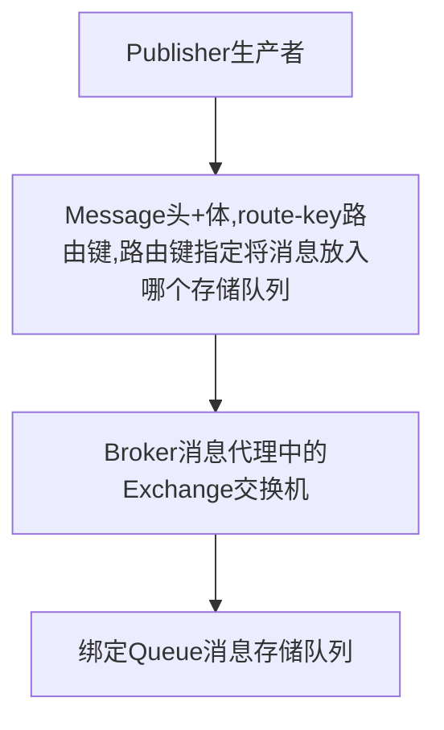

## 消息队列RabbitMQ

- 消息队列的作用
  - 异步处理
  - 应用解耦
  - 流量控制
- **重要概念**
  - 消息代理 (message broker)
  - 目的地 (destination)
    - 队列 (queue) : 点对点消息通信
      - 消息发送者发送消息消息代理将其放进一个队列中，消息接收者从队列中获取消息内容，消息读取后移除队列
      - 消息只有一个唯一的发送者和接收者，但不是说只能有一个接收者
    - 主题 (topic) : 发布/订阅 消息通信
      - 发送者发送消息到主题，多个接收者监听主题，消息到达时接收者同时收到消息
  - 规范
    - JMS(java messsage service) java 消息服务：基于jvm消息代理的规范
    - AMQP（advanced message queuing protocol）高级消息队列协议，兼容JMS 

**RabbitMQ概念**

- Messsage ： 消息是不具名的，由消息头和消息体组成，消息体是不透明的，消息头由可选的属性组成
- Publisher： 消息的生产者，也就是向消息中间件发布消息的服务
- Exchange：交换器，用来接受生产者发送的消息并将这些消息路由给服务器中的队列

**RabbitMQ消息发布模型**



**RabbitMQ消息消费者模型**

一个客户端只会建立一条连接

客户端通过Channel与Broker建立连接,一个Connection会有很多Channel

**RabbitMQ安装**

```bash
docker run -it --rm --name rabbitmq -p 5672:5672 -p 15672:15672 rabbitmq:3.9-management
```

