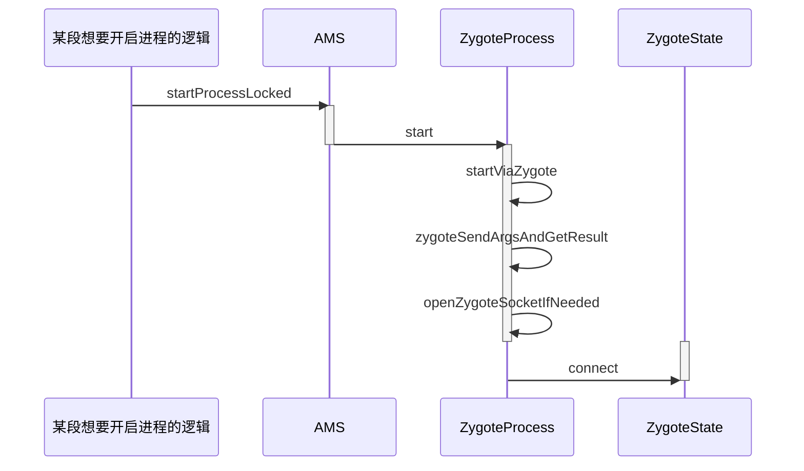

# 应用程序进程简介

当我们想要启动一个应用程序的时候,首先要保证该应用程序所需的进程时候已经启动,AMS在启动应用程序的时候会检测这应用程序需要的进程是否存在,不存在的话就会请求Zygote进程启动所需的进程,在Android系统启动的文章中我们知道了Zygote的Java层会创建一个Service端的Socket,该Socket用来等待AMS请求Zygote创建新的应用程序进程,Zygote进程通过Fock自身来创建应用程序进程,这样应用程序进程就获得了Zygote进程在启动时创建的虚拟机实例,应用程序进程创建过程中还创建了Binder线程池和消息循环,这样进程中的程序就可以使用Binder进行进程间通信了

# 应用程序进程启动过程介绍

应用程序进程创建过程的步骤比较多,分为两个部分解析分别是AMS发送启动应用程序进程的请求和Zygote接受请求并创建应用程序进程

## AMS发送启动应用程序进程请求

*启动过程的时序图*



AMS如果想要启动应用程序进程,就需要向Zygote进程发送**请求创建应用程序进程**的请求,AMS会通过调用**startProcessLocked**方法向Zygote进程发送请求

- startProcessLocked位于AMS类中

- 获取需要创建的应用程序进程的用户ID `int uid = app.uid;`

- 对gids进行创建和赋值，gids是用户组ID，可以方便应用程序共享一些资源

  ```java
                  if (ArrayUtils.isEmpty(permGids)) {
                      gids = new int[3];
                  } else {
                      gids = new int[permGids.length + 3];
                      System.arraycopy(permGids, 0, gids, 3, permGids.length);
                  }
                  gids[0] = UserHandle.getSharedAppGid(UserHandle.getAppId(uid));
                  gids[1] = UserHandle.getCacheAppGid(UserHandle.getAppId(uid));
                  gids[2] = UserHandle.getUserGid(UserHandle.getUserId(uid));
  ```

- 如果entryPrint为null，给其赋值 `if (entryPoint == null) entryPoint = "android.app.ActivityThread";`这个值是应用程序进程主线程的类名。

- 启动应用程序进程`startResult = Process.start(entryPoint,app.processName, uid, uid, gids, debugFlags, mountExternal,app.info.targetSdkVersion, seInfo, requiredAbi, instructionSet,app.info.dataDir, invokeWith, entryPointArgs);` 将得到的id个gis传递过去
