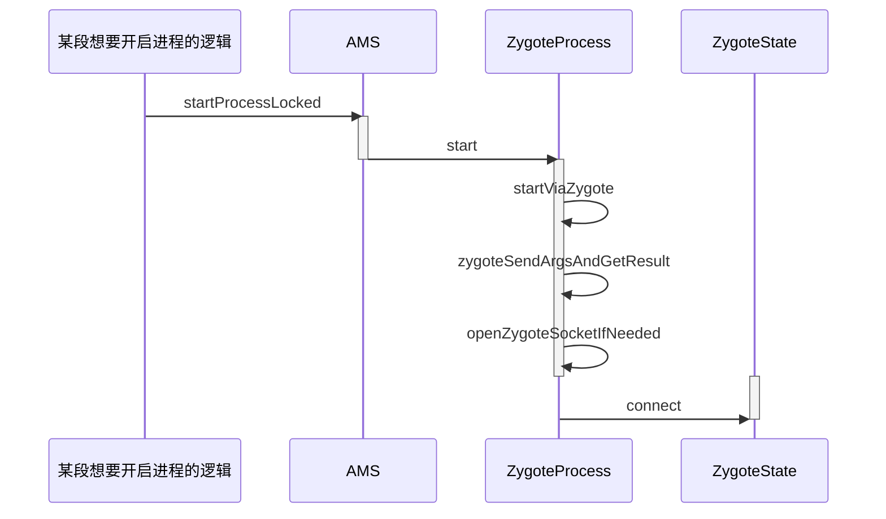
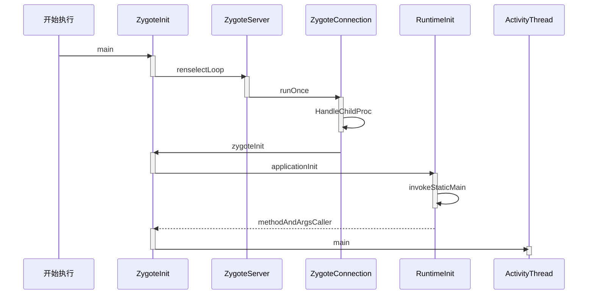

# 应用程序进程简介

当我们想要启动一个应用程序的时候,首先要保证该应用程序所需的进程时候已经启动,AMS在启动应用程序的时候会检测这应用程序需要的进程是否存在,不存在的话就会请求Zygote进程启动所需的进程,在Android系统启动的文章中我们知道了Zygote的Java层会创建一个Service端的Socket,该Socket用来等待AMS请求Zygote创建新的应用程序进程,Zygote进程通过Fock自身来创建应用程序进程,这样应用程序进程就获得了Zygote进程在启动时创建的虚拟机实例,应用程序进程创建过程中还创建了Binder线程池和消息循环,这样进程中的程序就可以使用Binder进行进程间通信了

# 应用程序进程启动过程介绍

应用程序进程创建过程的步骤比较多,分为两个部分解析分别是AMS发送启动应用程序进程的请求和Zygote接受请求并创建应用程序进程

## AMS发送启动应用程序进程请求

*启动过程的时序图*



AMS如果想要启动应用程序进程,就需要向Zygote进程发送**请求创建应用程序进程**的请求,AMS会通过调用**startProcessLocked**方法向Zygote进程发送请求

- startProcessLocked位于AMS类中

- 获取需要创建的应用程序进程的用户ID `int uid = app.uid;`

- 对gids进行创建和赋值，gids是用户组ID，可以方便应用程序共享一些资源

  ```java
                  if (ArrayUtils.isEmpty(permGids)) {
                      gids = new int[3];
                  } else {
                      gids = new int[permGids.length + 3];
                      System.arraycopy(permGids, 0, gids, 3, permGids.length);
                  }
                  gids[0] = UserHandle.getSharedAppGid(UserHandle.getAppId(uid));
                  gids[1] = UserHandle.getCacheAppGid(UserHandle.getAppId(uid));
                  gids[2] = UserHandle.getUserGid(UserHandle.getUserId(uid));
  ```

- 如果entryPrint为null，给其赋值 `if (entryPoint == null) entryPoint = "android.app.ActivityThread";`这个值是。

- 启动应用程序进程`startResult = Process.start(entryPoint,app.processName, uid, uid, gids, debugFlags, mountExternal,app.info.targetSdkVersion, seInfo, requiredAbi, instructionSet,app.info.dataDir, invokeWith, entryPointArgs);` 将得到的id个gis传递过去

- 在Process类*(位于frameworks\base\core\java\android\os)*的start方法中,调用了ZygoteProcess的Start方法,这个类是用来保持与Zygote进程的通信状态

- ZygoteProcess位于Process类的同级目录下,在其start方法中,主要是调用了**ZygoteProcess.startViaZygote**方法

- 在startViaZygote方法中创建了字符串列表**argsForZygote**,并且将应用进程启动参数保存在**argsForZygote**中

- 在startViaZygote方法最后调用了`return zygoteSendArgsAndGetResult(openZygoteSocketIfNeeded(abi), argsForZygote);`,我们调用了**openZygoteSocketIfNeeded**方法返回了一个**ZygoteState**的实例作为调用**zygoteSendArgsAndGetResult方法**的第一个参数,第二个参数为之前打包好的argsForZygote启动参数

  > **zygoteSendArgsAndGetResult**方法主要是将传入的应用进程启动参数**argsForZygote**写入ZygoteState中,在该方法中,ZygoteState是ZygoteProcess的静态内部类,用来表示和Zygote的通信状态,ZygoteState是由**openZygoteSocketIfNeeded**返回的,在这个方法中执行了以下代码
  >
  > - 和Zygote进程建立Socket连接`primaryZygoteState = ZygoteState.connect(mSocket);`返回一个ZygoteState类型的参数
  > - 判断Zygote主模式返回的ZygoteState是否**和当前启动应用程序进程所需的ABI匹配**`if(primaryZygoteState.matches(abi))`
  > - 如果不匹配,尝试连接Zygote辅模式`secondaryZygoteState = ZygoteState.connect(mSecondarySocket);`
  > - 判断辅模式返回的Zygote辅模式返回的ZygoteState是否和当前启动应用程序进程所需的ABI匹配`secondaryZygoteState.matches(abi)`
  > - 如果主模式和辅模式都不匹配,抛出**ZygoteStartFailedEx**异常

## Zygote接收请求并创建应用程序进程

Socket连接成功并且匹配ABI之后会返回ZygoteState类型的对象,我们当时将应用程序的启动参数**argsForZygote**写入了ZygoteState中,这样Zygote进程会受到一个创建新进程的请求,时序图如下



我们从ZygoteInit的main方法开始阅读

- 创建一个Server端的Socket,等待AMS的请求i`zygoteServer.registerServerSocket(socketName);`
- 预加载类和资源`preload(bootTimingsTraceLog);`
- 启动SystemServer进程`startSystemServer(abiList, socketName, zygoteServer);`
- 等待AMS请求`zygoteServer.runSelectLoop(abiList);`

接下来是ZygoteServer类的**runSelectLoop**方法

- 创建Zygote连接的数组`ArrayList<ZygoteConnection> peers = new ArrayList<ZygoteConnection>();`
- 调用ZygoteConnection的**runOnce**方法来处理请求数据`boolean done = peers.get(i).runOnce(this);`

在ZygoteConnection.runOnce中数据处理流程为

- 获取应用程序进程的启动参数`args = readArgumentList();`

- 将readArgumentList方法读取到的args封装为Arguments类型`parsedArgs = new Arguments(args);`

- 创建应用程序进程,传递的parsedArgs就是进程启动参数，返回值为pid

  ```java
  pid = Zygote.forkAndSpecialize(parsedArgs.uid, parsedArgs.gid, parsedArgs.gids,
                      parsedArgs.debugFlags, rlimits, parsedArgs.mountExternal, parsedArgs.seInfo,
                      parsedArgs.niceName, fdsToClose, fdsToIgnore, parsedArgs.instructionSet,
                      parsedArgs.appDataDir);
  ```

- 判断pid `if (pid == 0)`，如果为0，则说明当前的代码已经在新的子进程中运行了，这个时候调用**handleChildProc**来处理应用程序进程`handleChildProc(parsedArgs, descriptors, childPipeFd, newStderr);`

**handleChildProc**调用了ZygoteInit中的**zygoteInit**方法，该方法执行了以下两段核心逻辑

- 创建Binder线程池`ZygoteInit.nativeZygoteInit();`
- 调用RuntimeInit的applicationInit方法`RuntimeInit.applicationInit(targetSdkVersion, argv, classLoader);`

**RuntimeInit.applicationInit**是一个静态方法，位于*frameworks\base\core\java\com\android\internal\os*目录下

applicationInit方法调用了`invokeStaticMain(args.startClass, args.startArgs, classLoader);`  调用该方法的第一个参数是之前的ActivityThread也就是**应用程序进程主线程的类名**

接下来我们解析**invokeStaticMain**方法

- 获得**ActivityThread**类 `cl = Class.forName(className, true, classLoader);`

- 获得**ActivityThread**的Main方法`m = cl.getMethod("main", new Class[] { String[].class });`

- 通过抛出**Zygote.MethodAndArgsCaller**异常来启动main方法,这个做法和Zygote处理SystemServer进程是一样的,这样的处理方法会清理所有设置过程中所需要的堆栈帧

  > 在 Java 中，如果一个方法通过执行`return`语句来完成，或者通过成功执行声明为`void`的方法的最后一行，那么它被称为**正常完成**。
  >
  > 当一个方法正常完成时，JVM会弹出返回方法的栈帧，并在调用方法中的方法调用之后继续执行。调用方法成为当前方法，其堆栈帧成为当前帧。
  >
  > 如果一个方法抛出了一个它自己没有捕捉到的异常，那么就说它**突然完成**。突然完成的方法不会返回值，尽管它们确实传递了一个异常对象，例如`java.io.IOException`
  >
  > 当一个方法突然完成时，意味着它抛出了一个它自己没有捕获的异常，JVM 会弹出该方法的堆栈帧。然后，JVM 检查调用堆栈上的下一个方法，以查找处理抛出异常的 catch 子句。这个循环一直持续到发生以下两种情况之一：
  >
  > - 找到了具有正确 catch 子句的方法，其中 JVM 将使该方法的堆栈帧处于当前状态，并在 catch 子句中的第一条语句处继续执行。
  > - JVM 会检查`public static void main(String[] args)`调用栈，当它没有找到合适的 catch 子句时，它会弹出`main`的栈帧。调用堆栈现在是空的，因为`main`是线程调用的第一个方法。这会导致*未捕获*的异常，该异常将由默认处理程序处理，并导致线程死亡。在大多数 JRE（Java 运行时环境）中，未捕获异常的默认处理程序将在线程终止时打印出堆栈跟踪。

该异常抛出后,会在**ZygoteInit.main**方法中被捕获`catch (Zygote.MethodAndArgsCaller caller) {caller.run();}`,执行了MethodAndArgsCaller中的run方法,MethodAndArgsCaller是Zygote的静态内部类

在run方法中主要执行了`mMethod.invoke(null, new Object[] { mArgs });` mMethod就是ActivityThread的main方法,执行invoke后main方法会被动态调用,应用程序进程就到了ActivityThread.main中,到这里我们已经完成了应用程序进程的创建并且运行了**主线程的管理类ActivityThread**  

> ActivityThread这个类的源码位于`frameworks\base\core\java\android\app`

# Binder线程池启动过程

Zygote接收请求并创建应用程序进程的过程中会启动Binder线程池

在ZygoteInit.ZygoteInit方法中会调用一个native方法`ZygoteInit.nativeZygoteInit();`,在AndroidRuntime.cpp的**JNINativeMethod**数组中我们看到了nativeZygoteInit对应的函数是**com_android_internal_os_ZygoteInit_nativeZygoteInit** 

```c++
const JNINativeMethod methods[] = {{ "nativeZygoteInit", 
                                      "()V",
                                      (void*) com_android_internal_os_ZygoteInit_nativeZygoteInit },};
```

com_android_internal_os_ZygoteInit_nativeZygoteInit 函数中执行了`gCurRuntime->onZygoteInit();` gCurRuntime是AndroidRuntime类型的指针,在AndroidRuntime初始化时就创建了,在`AndroidRuntime::AndroidRuntime`方法中进行初始化`gCurRuntime = this;`

AppRuntime继承于AndroidRuntime, AppRuntime创建的时候会调用AndroidRuntime的构造函数,gCurruntime就会初始化,`gCurRuntime->onZygoteInit();`指向的就是**AppRuntime.onZygoteInit**函数,路径位于`frameworks\base\cmds\app_process`

AppRuntime.onZygoteInit函数调用了**ProcessState**的startThreadPool来启动Binder线程池`proc->startThreadPool();`

ProcessState位于`frameworks\native\libs\binder`

- 支持Binder通信的进程中都有一个ProcessState类,该类中有一个**mThreadPoolStarted变量**,用来表示Binder线程池是否已经启动过,默认值为false,在startThreadPool方法中,每次都会先判断一下 `if (!mThreadPoolStarted) ` 确保进程池只会启动一次
- 如果判断线程池并未启动,就将该变量设置为true   `mThreadPoolStarted = true;`,然后调用**spawnPooledThread(true)**函数来创建线程池中的第一个线程,也就是线程池的**主线程**

spawnPooledThread方法中创建了一个PoolThread对象`sp<Thread> t = new PoolThread(isMain);`,然后执行run函数`t->run(name.string());` 创建了一个**新的线程**

我们看看PoolThread类中都做了什么工作

- PoolThread类是ProcessState的内部类,并且继承于Thread
- 在threadLoop方法中调用了IPCThreadState的joinThreadPool函数,将当前线程注册到Binder驱动程序中`IPCThreadState::self()->joinThreadPool(mIsMain);` ,这样我们创建的线程就加入了线程池
- 我们只需要创建当前进程的Binder对象,并且注册到ServiceManager中就可以实现BInder进程间通信了

# 消息循环的创建过程

应用程序进程启动后会**创建消息循环**,我们回到RuntimeInit的**invokeStaticMain**方法

这个方法在最后一行执行了` throw new Zygote.MethodAndArgsCaller(m, argv);`,被ZygoteInit.main捕获后执行了`caller.run();`,caller是Zygote.MethodAndArgsCaller类型,在run方法中执行了`mMethod.invoke(null, new Object[] { mArgs });`来启动**ActivityThread.main**方法,ActivityThread类是用来管理当前应用程序进程的主线程,进行了以下工作

- 创建主线程Looper消息循环	`Looper.prepareMainLooper();`
- 创建ActivityThread    `ActivityThread thread = new ActivityThread();`
- 判断Handler类型的sMainThreadHandler是否为null,如果为null就创建主线程H类`sMainThreadHandler = thread.getHandler();`,这个H类继承自Handler,是AndroidThread的内部类
- Lopper开始工作 ,开始处理消息`Looper.loop();`

系统在应用程序进程启动完成后.创建了一个消息循环,这样运行在应用程序进程中的应用程序可以十分方便的使用消息处理机制

# 总结

在本片Blog中我们学完了Android应用程序进程的启动过程,Binder线程池启动过程,消息循环的启动过程

Binder线程池和消息循环是线程间通信的重要手段,Binder是Android中使用最广泛的IPC机制

