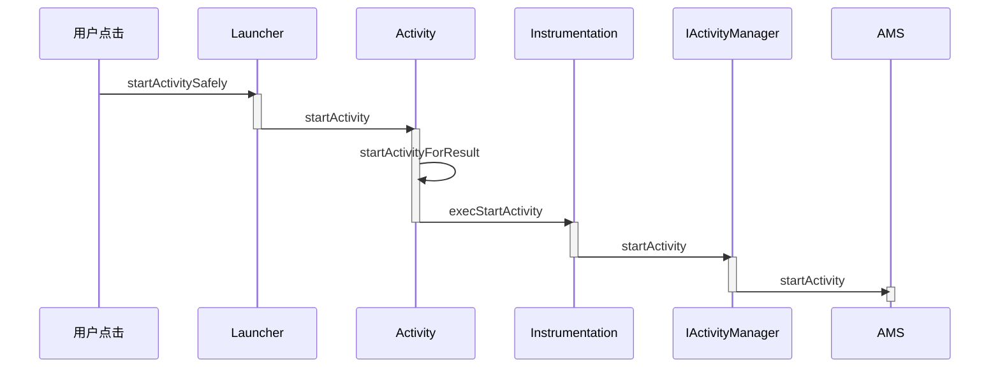
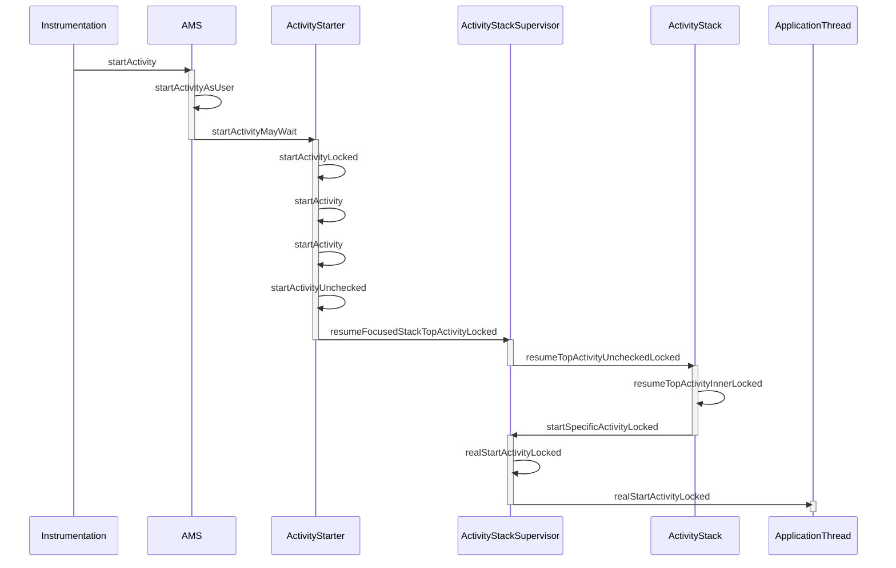
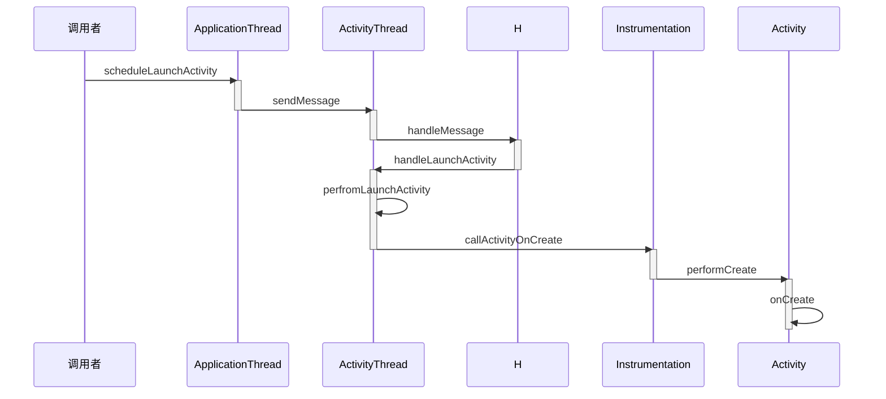
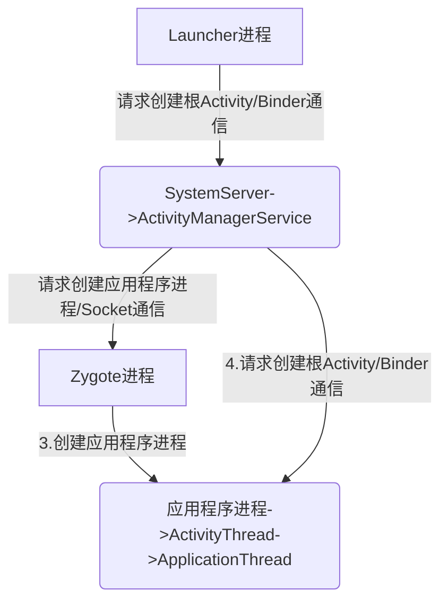
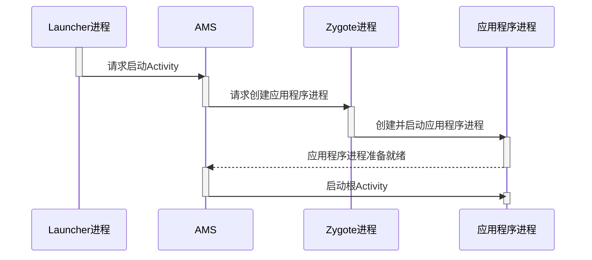
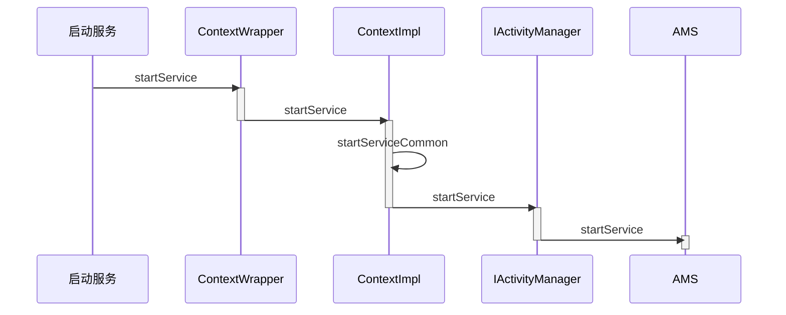
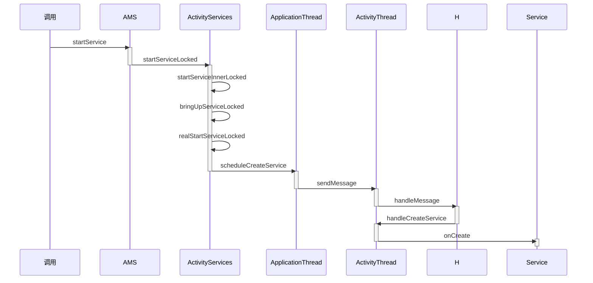
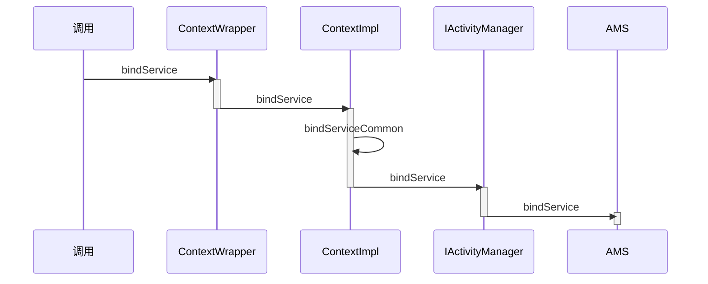

# 序言

在之前的两篇文章中介绍了系统启动的过程和应用程序进程的启动过程,应用程序进程启动后就该启动应用程序了,也就是启动**根Activity**

四大组件是应用开发中最常接触的,活动,服务,广播接收器,内容提供者,这篇文章会深入介绍它们的工作过程,四大组件的工作过程和**插件化**技术有所关联

# 根Activity的启动过程

Activity的启动过程分为两种,一种是根Activity的启动过程,一种是普通Activity的启动过程,**根Activity指的是应用程序启动的第一个Activity**,因此根Activity的启动过程可以理解为应用程序的启动过程,普通Activity指的是除了根Activity以外的Activity,根Activity和普通Activity启动是由重叠部分的,根Activity更为典型

根Activity启动过程较为繁琐,主要是分为三个部分

- **Launcher请求AMS**
- **AMS到ApplicationThread的调用**
- **ActivityThread启动Activity**

## Launcher请求AMS过程

Launcher启动后会将已经安装好的Application快捷图标显示到桌面上,这些快捷图标就是根Activity的入口,当我们点击某个应用程序的快捷图标时,会通过Launcher请求AMS来启动该应用程序,时序图如下所示



当点击应用程序的快捷图标时,调用Launcher的startActivitySafely方法

> Launcher类位于packages\apps\Launcher3\src\com\android\launcher3

在startActivitySafely方法中执行了两步较为重要的逻辑

- 为Intent设置Flags,这样根Activity会在新的任务栈中启动 `intent.addFlags(Intent.FLAG_ACTIVITY_NEW_TASK);`
- 调用`startActivity(intent, optsBundle);`这个方法在Activity中实现,Launcher这个类就是继承于Activity的

> Activity类位于frameworks\base\core\java\android\app

```java
 	@Override
    public void startActivity(Intent intent, @Nullable Bundle options) {
        if (options != null) {
            startActivityForResult(intent, -1, options);
        } else {
            startActivityForResult(intent, -1);
        }
    }
```

在该方法中会调用startActivityForResult方法,第二个参数为-1,说明请求者不需要知道Activity的启动结果

startActivityForResult方法有很多个,我们使用最典型的来说明

```java
public void startActivityForResult(@RequiresPermission Intent intent, int requestCode,@Nullable Bundle options)
```

在这个方法中先执行了判断`if (mParent == null)` mParent是Activity类型,表示当前Activity的父类,因为目前根Activity还没有创建出来,所以mParent == null为true

之后调用了`mInstrumentation.execStartActivity( this, mMainThread.getApplicationThread(), mToken, this, intent, requestCode, options);`这个方法,Instrumentation主要是用来监控应用程序和系统的交互,在该方法中执行了以下代码

```java
ActivityManager.getService()
               .startActivity(whoThread, who.getBasePackageName(), intent,
                        intent.resolveTypeIfNeeded(who.getContentResolver()),
                        token, target != null ? target.mEmbeddedID : null,
                        requestCode, 0, null, options);
```

首先调用ActivityManager的getService来获得AMS的代理对象,之后使用AMS来执行startActivity方法,此处逻辑和Android8.0以前有些不同,8.0之前的版本是通过ActivityManagerNative的getDefault来获得AMS的代理对象,8.0之后将这个逻辑封装到了ActivityManager中而不是ActivityManagerNative中

在ActivityManager.getService方法中返回了`IActivityManagerSingleton.get();`,IActivityManagerSingleton是一个Singleton类,实例化如下

```java
    private static final Singleton<IActivityManager> IActivityManagerSingleton =
            new Singleton<IActivityManager>() {
                @Override
                protected IActivityManager create() {
                    //得到名为activity的Service引用,也就是IBinder类型的AMS引用
                    final IBinder b = ServiceManager.getService(Context.ACTIVITY_SERVICE);
                    //将IBinder类型的AMS引用转换为IActivityManager类型的对象
                    final IActivityManager am = IActivityManager.Stub.asInterface(b);
                    return am;
                }
            };
```

将IBinder类型的AMS转换的类是采用了AIDL`Android Interface Definition Language` IActivityManager是由AIDL工具在编译时自动生成的,位于*frameworks\base\core\java\android\app*文件夹下,如果要实现进程间的通信,服务端(也就是AMS)只需要继承IActivityManager.Stud并实现相对的方法即可

>  [官方对于AIDL的解释](https://developer.android.com/guide/components/aidl?hl=zh-cn) 其主要使用过程为
>
> 1. 创建 .aidl 文件
>
>    此文件定义带有方法签名的编程接口。
>
> 2. 实现接口
>
>    Android SDK 工具会基于您的 `.aidl` 文件，使用 Java 编程语言生成接口。此接口拥有一个名为 `Stub` 的内部抽象类，用于扩展 `Binder` 类并实现 AIDL 接口中的方法。您必须扩展 `Stub` 类并实现这些方法。
>
> 3. 向客户端公开接口
>
>    实现 `Service` 并重写 `onBind()`，从而返回 `Stub` 类的实现。

## AMS到ApplicationThread的调用过程

Launcher请求AMS之后,代码就执行到了AMS部分,,AMS调用ApplicationThread的流程为



按照流程首先是`ActivityManagerService.startActivity`方法,*AMS位于frameworks\base\services\core\java\com\android\server\am*

`ActivityManagerService.startActivity`方法会执行以下代码片段

```java
startActivityAsUser(caller, callingPackage, intent, resolvedType, resultTo,
                resultWho, requestCode, startFlags, profilerInfo, bOptions,
                UserHandle.getCallingUserId());
```

startActivityAsUser这个方法和startActivity方法相比多了一个`UserHandle.getCallingUserId()`参数,这个方法会获得调用者的UserId,AMS根据该UserId来确定调用者的身份

startActivityAsUser执行了以下行为

- 判断调用者进程是否被隔离 `enforceNotIsolatedCaller("startActivity");`,如果被隔离会抛出`SecurityException`异常

- 检测调查者权限`userId = mUserController.handleIncomingUser(Binder.getCallingPid(),Binder.getCallingUid(),userId, false, ALLOW_FULL_ONLY, "startActivity", null);` ,如果没有权限也抛出 `SecurityException`异常

- 调用ActivityStarter.startActivityMayWait方法

  ```java
  mActivityStarter.startActivityMayWait(caller, -1, callingPackage, intent,
                  resolvedType, null, null, resultTo, resultWho, requestCode, startFlags,
                  profilerInfo, null, null, bOptions, false, userId, null,
  				//TaskRecord类型,代表启动的Activity所在的栈
  				null,                   
  				//表示启动的理由
                  "startActivityAsUser")
  ```
  
  > ActivityStarter是在Android7.0中新加入的类,是加载Activity的控制类,该类会收集所有的逻辑来决定如何将Intent和Flag转换为Activity,并且将Activity和Task以及Stack相关联

ActivityStarter.startActivityMayWait方法中执行了ActivityStarter.startActivityLocked方法

```java
startActivityLocked(caller, intent, null /*ephemeralIntent*/,
                            resolvedTypes[i], aInfo, null /*rInfo*/, null, null, resultTo, null, -1,
                            callingPid, callingUid, callingPackage,
                            realCallingPid, realCallingUid, 0,
                            options, false, componentSpecified, outActivity, null, null, reason);
```

在ActivityStarter.startActivityLocked方法中先判断启动理由`if (TextUtils.isEmpty(reason))` 如果为空就抛出IllegalArgumentException异常,之后调用ActivityStarter.startActivity方法,执行了以下逻辑

- 判断`if (caller != null) `caller是IApplicationThread类型,这个caller是外围一直传进来的,指向的是Launcher所在的应用程序进程的ApplicationThread类

- 得到Launcher进程`callerApp = mService.getRecordForAppLocked(caller);` mService是AMS类型, getRecordForAppLocked会返回一个**ProcessRecord**类型,ProcessRecord用来描述一个应用程序进程

- 创建**ActivityRecord**,ActivityRecord是用来描述即将要启动的Activity 

  ```java
  ActivityRecord r = new ActivityRecord(mService, callerApp, callingPid, callingUid,
                  callingPackage, intent, resolvedType, aInfo, mService.getGlobalConfiguration(),
                  resultRecord, resultWho, requestCode, componentSpecified, voiceSession != null,
                  mSupervisor, container, options, sourceRecord);
  ```

- 将创建的**ActivityRecord**赋值给ActivityRecord数组0号`outActivity[0] = r;`,这个数组将会在后续传递给下一层

- 最后调用了

  ```java
  startActivity(r, sourceRecord, voiceSession, voiceInteractor, startFlags, true,
                  options, inTask, outActivity);
  ```

最后调用的startActivity是ActivityStarter中的另一个方法,这个方法比较简单,紧接着就调用了`startActivityUnchecked(r, sourceRecord, voiceSession, voiceInteractor,startFlags, doResume, options, inTask, outActivity);`

startActivityUnchecked方法主要是处理和栈管理相关的逻辑

- 由于我们启动根Activity的时候添加了`Intent.FLAG_ACTIVITY_NEW_TASK`这一个Flag,我已我们判断`if (mStartActivity.resultTo == null && mInTask == null && !mAddingToTask && (mLaunchFlags & FLAG_ACTIVITY_NEW_TASK) != 0)`会得到true
- 由于之前判断==true,会执行`result = setTaskFromReuseOrCreateNewTask(taskToAffiliate, preferredLaunchStackId, topStack);`,创建新的TaskRecord,**用来描述Activity的任务栈**,Activity任务栈其实是一个假象的模型,并不真实存在
- 调用`mSupervisor.resumeFocusedStackTopActivityLocked(mTargetStack, mStartActivity,mOptions);` mSupervisor是ActivityStackSupervisor类型

接下来来到**ActivityStackSupervisor.resumeFocusedStackTopActivityLocked**方法

- 获取要启动的Activity**所在栈的栈顶**的**不是处于停止状态**的ActivityRecord  `final ActivityRecord r = mFocusedStack.topRunningActivityLocked();`
- 判断ActivityRecord是不是为null,或者要启动的Activity是不是RESUME状态`if (r == null || r.state != RESUMED)`
- 如果判定为true,执行`mFocusedStack.resumeTopActivityUncheckedLocked(null, null);`,对于即将要启动的Activity,上方条件一定是满足的,mFocusedStack是ActivityStack类型

接下来来到**ActivityStack.resumeTopActivityUncheckedLocked**方法,该方法中执行了`resumeTopActivityInnerLocked(prev, options);`然后来到了**resumeTopActivityInnerLocked**方法中,resumeTopActivityInnerLocked又调用了`mStackSupervisor.startSpecificActivityLocked(next, true, true);`进入了**ActivityStackSupervisor.startSpecificActivityLocked**中,在该方法中执行了以下代码

- 获取即将启动的Activity所在的应用程序进程`ProcessRecord app = mService.getProcessRecordLocked(r.processName,r.info.applicationInfo.uid, true);`
- 判断要启动的Activity所在的应用程序进程是否正在运行`app != null && app.thread != null`
- 如果已经运行的话,调用`realStartActivityLocked(r, app, andResume, checkConfig);`,该方法第二个参数代表要启动的Activity所在的应用程序进程的ProcessRecord

接下来运行到了**ActivityStackSupervisor.realStartActivityLocked**中,最主要的是执行了

```java
app.thread.scheduleLaunchActivity(new Intent(r.intent), r.appToken,
                    System.identityHashCode(r), r.info,
                    // TODO: Have this take the merged configuration instead of separate global and
                    // override configs.
                    mergedConfiguration.getGlobalConfiguration(),
                    mergedConfiguration.getOverrideConfiguration(), r.compat,
                    r.launchedFromPackage, task.voiceInteractor, app.repProcState, r.icicle,
                    r.persistentState, results, newIntents, !andResume,
                    mService.isNextTransitionForward(), profilerInfo);
```

这里的app指的是**要启动的Activity所在的应用程序进程**

这里的app.thread指的是IApplicationThread,来源是**ActivityThread的内部类ApplicationThread**,该类继承于**IApplicationThread.Stub**

**这段代码指的就是要在目标应用程序进程启动Activity**,这段代码运行在AMS进程中,通过ApplicationThread何应用程序进程进行Binder通信,ApplicationThread就是AMS进程何应用程序进程通信的桥梁

## ActivityThread启动Activity的过程

从AMS到ApplicationThread过程中我们从AMS进程运行到了应用程序进程,启动Activity的最后一个步骤就是ActivityThread启动Activity




从ApplicationThread的scheduleLaunchActivity方法开始解析,ApplicationThread是ActivityThread的内部类,**应用程序进程创建后会**运行代表主线程的实例ActivityThread,其**管理着当前应用程序进程的主线程**

scheduleLaunchActivity方法中执行了以下逻辑

- 将启动Activity的参数封装成ActivityClientRecord 

  ```java
              ActivityClientRecord r = new ActivityClientRecord();
  
              r.token = token;
              r.ident = ident;
              r.intent = intent;
              r.referrer = referrer;
              r.voiceInteractor = voiceInteractor;
              r.activityInfo = info;
              r.compatInfo = compatInfo;
              r.state = state;
              r.persistentState = persistentState;
  
              r.pendingResults = pendingResults;
              r.pendingIntents = pendingNewIntents;
  
              r.startsNotResumed = notResumed;
              r.isForward = isForward;
  
              r.profilerInfo = profilerInfo;
  
              r.overrideConfig = overrideConfig;
  ```

- 调用sendMessage方法向H类发送类型为LAUNCH_ACTIVITY的消息.并将ActivityClientRecord传递过去

  ```java
  sendMessage(H.LAUNCH_ACTIVITY, r);
  ```

sendMessage方法有多个重载方法,最终核心是执行这一句

```java
mH.sendMessage(msg);
```

这个mH就是H类,H类是ActivityThread的内部类并继承只Handler,是应用程序进程中**主线程的消息管理器**,ApplicationThread本质上是一个Binder,其逻辑执行在Binder线程池中,所以需要使用H类来**切换到主线程**

消息发送sendMessage出去后会在H类中的**handleMessage**方法中执行,执行逻辑如下

- 判断msg.what是否是LAUNCH_ACTIVITY类型

- 如果是的话,将msg的obj变量强转为ActivityClientRecord 

  ```java
  final ActivityClientRecord r = (ActivityClientRecord) msg.obj;
  ```

- 使用getPackageInfoNoCheck方法来获得LoaderApk类型的对象并且赋值给r.packageInfo.  应用程序进程要启动Activity时要将该Activity所属的APK加载进来,LoadedApk就是用来描述已经加载的APK文件的

  ```java
  r.packageInfo = getPackageInfoNoCheck(r.activityInfo.applicationInfo, r.compatInfo);
  ```

- 调用`handleLaunchActivity(r, null, "LAUNCH_ACTIVITY");`

在handleLaunchActivity方法中,执行了以下逻辑

- 使用performLaunchActivity方法来启动Activity

  ```java
  Activity a = performLaunchActivity(r, customIntent);
  ```

- 如果将performLaunchActivity返回的不为null的话,Activity的状态设置为Resume

  ```java
  handleResumeActivity(r.token, false, r.isForward,
                       !r.activity.mFinished && !r.startsNotResumed, r.lastProcessedSeq, reason);
  ```

- 如果performLaunchActivity返回为null的话,通知AMS停止启动Activity

  ```java
  ActivityManager.getService().finishActivity(r.token, Activity.RESULT_CANCELED, null,
                               				Activity.DONT_FINISH_TASK_WITH_ACTIVITY);
  ```

逻辑来到performLaunchActivity方法中

- 获取ActivityInfo,**用来存储代码和AndroidManifest设置的Activity和Receiver节点信息**,例如Activity的主题和启动模式

  ```java
  ActivityInfo aInfo = r.activityInfo;
  ```

- 获取APK文件的描述类LoadedApk

  ```java
  r.packageInfo = getPackageInfo(aInfo.applicationInfo, r.compatInfo,
  			                   Context.CONTEXT_INCLUDE_CODE);
  ```

- 获取要启动的Activity的ComponentName类,这个类保存了该Activity的包名和类名

  ```java
  component = r.intent.resolveActivity(mInitialApplication.getPackageManager());
  ```

- 创建要启动Activity的上下文环境

  ```java
  ContextImpl appContext = createBaseContextForActivity(r);
  ```

- 根据ComponentName中存储的Activity类名,使用类加载器来创建Activity的实例

  ```java
  activity = mInstrumentation.newActivity(cl, component.getClassName(), r.intent);
  ```

- 创建Application,makeApplication方法内部会调用Application.onCreate方法

  ```java
  Application app = r.packageInfo.makeApplication(false, mInstrumentation);
  ```

- 调用Activity自身的attach方法初始化Activity,**attach方法中会创建Window对象并和Activity进行关联**

  ```java
  activity.attach(appContext, this, getInstrumentation(), r.token,
  				r.ident, app, r.intent, r.activityInfo, title, r.parent,
                  r.embeddedID, r.lastNonConfigurationInstances, config,
                  r.referrer, r.voiceInteractor, window, r.configCallback);
  ```

- 调用**Instrumentation.callActivityOnCreate**来启动Activity

  ```java
  mInstrumentation.callActivityOnCreate(activity, r.state, r.persistentState);
  ```

**Instrumentation.callActivityOnCreate**方法很简单,只是调用Activity的performCreate方法

```java
 public void callActivityOnCreate(Activity activity, Bundle icicle,PersistableBundle persistentState) {
        prePerformCreate(activity);
        activity.performCreate(icicle, persistentState);
        postPerformCreate(activity);
    }
```

最后一步到了**Activity.performCreate**,他会调用**Activity.onCreate**方法来启动Activity

```java
final void performCreate(Bundle icicle, PersistableBundle persistentState) {
        restoreHasCurrentPermissionRequest(icicle);
        onCreate(icicle, persistentState);
        mActivityTransitionState.readState(icicle);
        performCreateCommon();
    }
```

***到此为止,根Activtiy启动了***

## 根Activity启动过程中涉及到的进程

根Activity启动过程中会涉及到4个进程,分别是	**Zygote进程	Launcher进程	AMS所在进程	应用程序进程**



1. 首先Launcher进程向AMS请求创建根Activity,**AMS判断根Activity所需的应用程序进程是否存在并启动**
2. 如果不存在就请求Zygote创建应用程序进程
3. 应用程序进程启动后,AMS请求创建应用程序进程,并启动根Activity



**普通Activity启动会涉及到两个进程,分别是AMS进程和应用程序进程**

# Service的启动过程

Service的启动过程和根Activity启动过程有部分相似的要点,Service启动过程也涉及到Context的知识,Service启动过程主要分为两个部分

- ContextImpl到ActivityManagerService的调用过程
- ActivityThread启动Service的过程

## ContextImpl到AMS的调用过程




想要启动Service,我们需要调用startService方法,该方法在ContextWrapper中实现

> ContextWrapper位于frameworks\base\core\java\android\content

在**ContextWrapper.startService**方法中调用了

```java
mBase.startService(service);
```

mBase是Context类型,我们知道ActivityThread启动根Activity的时候执行了

```java
ContextImpl appContext = createBaseContextForActivity(r);
```

创建了上下文对象,并且传入了Activity的attach方法中将上下文和Activity关联了起来,在`createBaseContextForActivity`方法中使用**ContextImpl.createActivityContext**方法创建了ContextImpl类型的appContext变量并且return了出去

**在Activity的attach方法中,将ContextImpl赋值给了ContextWrapper的成员变量mBase,所以mBase指向的就是ContextImpl**

接下来解析ContextImpl的startService方法

> ContextImpl位于frameworks\base\core\java\android\app

```java
    @Override
    public ComponentName startService(Intent service) {
        warnIfCallingFromSystemProcess();
        return startServiceCommon(service, false, mUser);
    }

    private ComponentName startServiceCommon(Intent service, boolean requireForeground,
            UserHandle user) {
        try {
            validateServiceIntent(service);
            service.prepareToLeaveProcess(this);
            //在这里调用了AMS的代理IActivityManager的startService方法,最终调用到AMS.startService
            ComponentName cn = ActivityManager.getService().startService(
                mMainThread.getApplicationThread(), service, service.resolveTypeIfNeeded(
                            getContentResolver()), requireForeground,
                            getOpPackageName(), user.getIdentifier());
            if (cn != null) {
                if (cn.getPackageName().equals("!")) {
                    throw new SecurityException(
                            "Not allowed to start service " + service
                            + " without permission " + cn.getClassName());
                } else if (cn.getPackageName().equals("!!")) {
                    throw new SecurityException(
                            "Unable to start service " + service
                            + ": " + cn.getClassName());
                } else if (cn.getPackageName().equals("?")) {
                    throw new IllegalStateException(
                            "Not allowed to start service " + service + ": " + cn.getClassName());
                }
            }
            return cn;
        } catch (RemoteException e) {
            throw e.rethrowFromSystemServer();
        }
    }

```

## ActivityThread启动service



从AMS的startService方法中执行了下面这段代码

```java
res = mServices.startServiceLocked(caller, service,
				                   resolvedType, callingPid, callingUid,
                				   requireForeground, callingPackage, userId);
```

mServices是**ActivityServices**类型,ActivityServices.startServiceLocked方法中进行了下列行为

查找是否有和参数Service对应的ServiceRecord

如果没有找到ServiceRecode,调用PagerManagerService来获得参数service对应的Service信息,并且封装到ServiceRecord中,**最后将ServiceRecode封装为ServiceLookupResult返回**

```java
ServiceLookupResult res = retrieveServiceLocked(service, resolvedType, callingPackage,
                    							callingPid, callingUid, userId, true, callerFg, false);
```

ServiceRecord用来描述一个Service,和ActivityRecord类似

之后会得到**ServiceLookupResult.record**对象,赋值给ServiceRecord对象`ServiceRecord r = res.record;`然后调用startServiceInnerLocked方法将ServiceRecord传递进去

```java
ComponentName cmp = startServiceInnerLocked(smap, service, r, callerFg, addToStarting);
```

在startServiceInnerLocked方法中又调用了**bringUpServiceLocked**

```
String error = bringUpServiceLocked(r, service.getFlags(), callerFg, false, false);
```

bringUpServiceLocked方法做了很多工作

- 获得ServiceRecord的processName并且赋值给procName,processName是用来描述Service想要在那个进程中运行,默认是当前进程,当然也可以在清单文件中设置`android:process`属性来设置开启一个进程运行Service

  ```java
  final String procName = r.processName;
  ```

- 将procName和Service的uid传入AMS的getProcessRecordLocked方法,返回了一个ProcessRecord类型的app实例,该实例的作用是用来描述运行的应用程序进程的信息

  ```java
  app = mAm.getProcessRecordLocked(procName, r.appInfo.uid, false);
  ```

- 判断Service对应的app是否不为null `if (app != null && app.thread != null)`,**说明用来运行Service的应用程序进程存在**

  - 启动Service

    ```java
    realStartServiceLocked(r, app, execInFg);
    ```

- 判断Service对应的app是否为null `if (app == null && !permissionsReviewRequired)` **说明用来运行Service的应用程序进程不存在**

  - 调用AMS的startProcessLocked方法来创建对应的应用程序进程

    ```
    mAm.startProcessLocked(procName, r.appInfo, true, intentFlags,
    	                   hostingType, r.name, false, isolated, false)
    ```

在这里我们只讨论没有设置`android:process`参数的情况,不需要创建新的应用程序进程,进程存在的情况,关于应用程序进程的创建我在应用程序进程的启动过程文章中已经研究过了

代码执行到**realStartServiceLocked**方法,该方法中调用了app.thread的scheduleCreateService方法

```java
app.thread.scheduleCreateService(r, r.serviceInfo,
				                 mAm.compatibilityInfoForPackageLocked(r.serviceInfo.applicationInfo),
					             app.repProcState);
```

app.thread是IApplicationThread类型的,由ActivityThread的内部类ApplicationThrea实现,将Service的参数封装成CreateServiceData,然后向H类发送**CREATE_SERVICE**消息

```java
public final void scheduleCreateService(IBinder token,
                ServiceInfo info, CompatibilityInfo compatInfo, int processState) {
            updateProcessState(processState, false);
            CreateServiceData s = new CreateServiceData();
            s.token = token;
            s.info = info;
            s.compatInfo = compatInfo;
            sendMessage(H.CREATE_SERVICE, s);
        }
```

sendMessage方法中执行了`mH.sendMessage(msg);`,这个mH是H类,是ActivityThread的内部类并且继承于Handler,是应用程序进程中主线程的消息管理类

接下来到了H类的消息接收者**H.handleMessage**中,使用switch判断了**msg.what**,当case为**CREATE_SERVICE**的时候,会调用**handleCreateService**方法来处理消息

```java
private void handleCreateService(CreateServiceData data) {
        unscheduleGcIdler();
		//获得要启动Service的应用程序的LoadedApk,LoadedApk是Apk文件的描述器
        LoadedApk packageInfo = getPackageInfoNoCheck(
                data.info.applicationInfo, data.compatInfo);
        Service service = null;
        try {
            //获得类加载器
            java.lang.ClassLoader cl = packageInfo.getClassLoader();
            //使用类加载器根据CreateServiceData中存储的Service信息来启动Service实例
            service = (Service) cl.loadClass(data.info.name).newInstance();
        } catch (Exception e) {
            if (!mInstrumentation.onException(service, e)) {
                throw new RuntimeException(
                    "Unable to instantiate service " + data.info.name
                    + ": " + e.toString(), e);
            }
        }

        try {
            if (localLOGV) Slog.v(TAG, "Creating service " + data.info.name);
			//创建Service上下文环境对象
            ContextImpl context = ContextImpl.createAppContext(this, packageInfo);
            context.setOuterContext(service);

            Application app = packageInfo.makeApplication(false, mInstrumentation);
            //使用Service的attach方法来初始化Service,让Service的信息附着上Service
            service.attach(context, this, data.info.name, data.token, app,
                    ActivityManager.getService());
            //调用service的onCreate方法,Service正式启动
            service.onCreate();
            //将启动的Service放入mServices中,mServices是 ArrayMap<IBinder, Service> 类型
            mServices.put(data.token, service);
            try {
                ActivityManager.getService().serviceDoneExecuting(
                        data.token, SERVICE_DONE_EXECUTING_ANON, 0, 0);
            } catch (RemoteException e) {
                throw e.rethrowFromSystemServer();
            }
        } catch (Exception e) {
            if (!mInstrumentation.onException(service, e)) {
                throw new RuntimeException(
                    "Unable to create service " + data.info.name
                    + ": " + e.toString(), e);
            }
        }
    }
```

***到此为止Service正式启动***

# Service的绑定过程

我们可以通过调用context的startService来启动Service,也可以通过Context的bindSevice来**绑定Service**,绑定Service的过程要比启动Service过程复杂一些

流程主要分为两个部分

- ContextImpl到AMS的调用过程
- Service的绑定过程

## ContextImpl到AMS的调用过程

bindService方法用来绑定Service,在ContextWrapper中实现



**ContextWrapper.bindService**代码如下

```java
@Override
public boolean bindService(Intent service, ServiceConnection conn,int flags) {
        return mBase.bindService(service, conn, flags);
}
```

mBase指向的就是ContextImpl,    **ContextImpl.bindService**方法如下,调用了bindServiceCommon方法

```java
@Override
public boolean bindService(Intent service, ServiceConnection conn,int flags) {
        warnIfCallingFromSystemProcess();
        return bindServiceCommon(service, conn, flags, mMainThread.getHandler(),
                Process.myUserHandle());
}
```

**bindServiceCommon**方法中执行了如下逻辑

- 调用LoadedApk类型的**mPackageInfo**的getServiceDispatcher方法,其主要作用是**将ServiceConnection封装为IServiceConnection类型的对象sd**,这个类的名字是自解释的实现了Binder线程通信,这样Service的绑定就支持了跨线程

  ```java
  sd = mPackageInfo.getServiceDispatcher(conn, getOuterContext(), handler, flags);
  ```

- 调用AMS的bindService方法

  ```java
  int res = ActivityManager.getService().bindService(
                  mMainThread.getApplicationThread(), getActivityToken(), service,
                  service.resolveTypeIfNeeded(getContentResolver()),
                  sd, flags, getOpPackageName(), user.getIdentifier());
  ```

  

## AMS中绑定Service

在AMS的bindServicce方法最后会调用**ActiveService**类型的mService的bindServiceLocked方法

```java
mServices.bindServiceLocked(caller, token, service,resolvedType, connection, flags, callingPackage, userId);
```

首先我们说明几个和Service相关的对象类型,更有助于下面的理解

- ServiceRecord：用来描述一个Service
- ProcessRecord： 一个进程的信息
- ConnectionRecord：用于描述应用程序进程和Service建立的一次通信
- AppBindRecord：应用程序进程通过Intent绑定Service时，会通过AppBindRecord来维护Service和应用程序进程之间的关联，内部存储了谁绑定的Service*(ProcessRecord)*，被绑定的Service*(AppBindService)*，绑定Service的Intent*(IntentBindRecord)*，所有绑定通信记录的信息*(ArraySet &lt;ConnectionRecord&gt; )*
- IntentBindRecord：用于描述绑定Service的Intent

**ActiveService.bindServiceLocked**方法中执行了以下逻辑

-   调用ServiceRecord的
