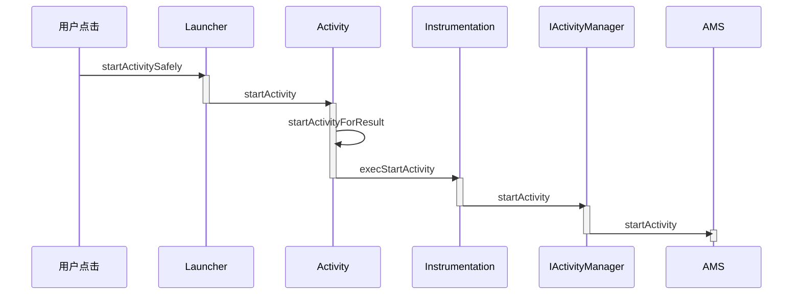

# 序言

在之前的两篇文章中介绍了系统启动的过程和应用程序进程的启动过程,应用程序进程启动后就该启动应用程序了,也就是启动**根Activity**

四大组件是应用开发中最常接触的,活动,服务,广播接收器,内容提供者,这篇文章会深入介绍它们的工作过程,四大组件的工作过程和**插件化**技术有所关联

# 根Activity的启动过程

Activity的启动过程分为两种,一种是根Activity的启动过程,一种是普通Activity的启动过程,**根Activity指的是应用程序启动的第一个Activity**,因此根Activity的启动过程可以理解为应用程序的启动过程,普通Activity指的是除了根Activity以外的Activity,根Activity和普通Activity启动是由重叠部分的,根Activity更为典型

根Activity启动过程较为繁琐,主要是分为三个部分

- **Launcher请求AMS**
- **AMS到ApplicationThread的调用**
- **ActivityThread启动Activity**

## Launcher请求AMS过程

Launcher启动后会将已经安装好的Application快捷图标显示到桌面上,这些快捷图标就是根Activity的入口,当我们点击某个应用程序的快捷图标时,会通过Launcher请求AMS来启动该应用程序,时序图如下所示



当点击应用程序的快捷图标时,调用Launcher的startActivitySafely方法

> Launcher类位于packages\apps\Launcher3\src\com\android\launcher3

在startActivitySafely方法中执行了两步较为重要的逻辑

- 为Intent设置Flags,这样根Activity会在新的任务栈中启动 `intent.addFlags(Intent.FLAG_ACTIVITY_NEW_TASK);`
- 调用`startActivity(intent, optsBundle);`这个方法在Activity中实现,Launcher这个类就是继承于Activity的

> Activity类位于frameworks\base\core\java\android\app

```java
 	@Override
    public void startActivity(Intent intent, @Nullable Bundle options) {
        if (options != null) {
            startActivityForResult(intent, -1, options);
        } else {
            startActivityForResult(intent, -1);
        }
    }
```

在该方法中会调用startActivityForResult方法,第二个参数为-1,说明请求者不需要知道Activity的启动结果

startActivityForResult方法有很多个,我们使用最典型的来说明

` public void startActivityForResult(@RequiresPermission Intent intent, int requestCode,@Nullable Bundle options)`

