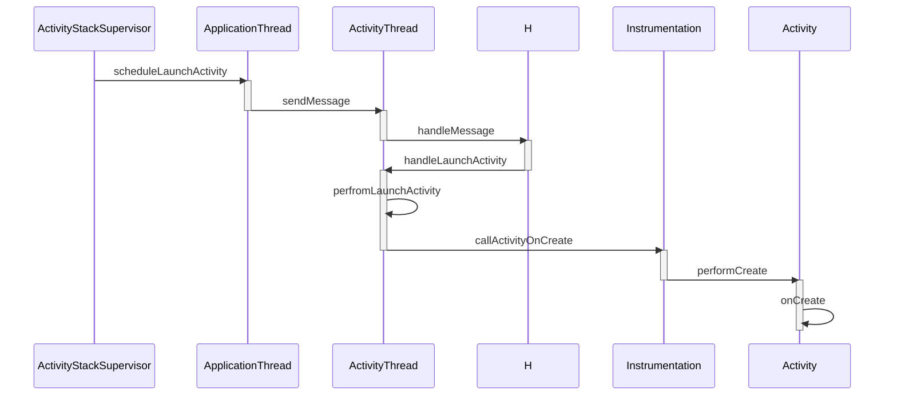

# 序言

在之前的两篇文章中介绍了系统启动的过程和应用程序进程的启动过程,应用程序进程启动后就该启动应用程序了,也就是启动**根Activity**

四大组件是应用开发中最常接触的,活动,服务,广播接收器,内容提供者,这篇文章会深入介绍它们的工作过程,四大组件的工作过程和**插件化**技术有所关联

# 根Activity的启动过程

Activity的启动过程分为两种,一种是根Activity的启动过程,一种是普通Activity的启动过程,**根Activity指的是应用程序启动的第一个Activity**,因此根Activity的启动过程可以理解为应用程序的启动过程,普通Activity指的是除了根Activity以外的Activity,根Activity和普通Activity启动是由重叠部分的,根Activity更为典型

根Activity启动过程较为繁琐,主要是分为三个部分

- **Launcher请求AMS**
- **AMS到ApplicationThread的调用**
- **ActivityThread启动Activity**

## Launcher请求AMS过程

Launcher启动后会将已经安装好的Application快捷图标显示到桌面上,这些快捷图标就是根Activity的入口,当我们点击某个应用程序的快捷图标时,会通过Launcher请求AMS来启动该应用程序,时序图如下所示


当点击应用程序的快捷图标时,调用Launcher的startActivitySafely方法

> Launcher类位于packages\apps\Launcher3\src\com\android\launcher3

在startActivitySafely方法中执行了两步较为重要的逻辑

- 为Intent设置Flags,这样根Activity会在新的任务栈中启动 `intent.addFlags(Intent.FLAG_ACTIVITY_NEW_TASK);`
- 调用`startActivity(intent, optsBundle);`这个方法在Activity中实现,Launcher这个类就是继承于Activity的

> Activity类位于frameworks\base\core\java\android\app

```java
 	@Override
    public void startActivity(Intent intent, @Nullable Bundle options) {
        if (options != null) {
            startActivityForResult(intent, -1, options);
        } else {
            startActivityForResult(intent, -1);
        }
    }
```

在该方法中会调用startActivityForResult方法,第二个参数为-1,说明请求者不需要知道Activity的启动结果

startActivityForResult方法有很多个,我们使用最典型的来说明

` public void startActivityForResult(@RequiresPermission Intent intent, int requestCode,@Nullable Bundle options)`

在这个方法中先执行了判断`if (mParent == null)` mParent是Activity类型,表示当前Activity的父类,因为目前根Activity还没有创建出来,所以mParent == null为true

之后调用了`mInstrumentation.execStartActivity( this, mMainThread.getApplicationThread(), mToken, this, intent, requestCode, options);`这个方法,Instrumentation主要是用来监控应用程序和系统的交互,在该方法中执行了以下代码

```java
ActivityManager.getService()
               .startActivity(whoThread, who.getBasePackageName(), intent,
                        intent.resolveTypeIfNeeded(who.getContentResolver()),
                        token, target != null ? target.mEmbeddedID : null,
                        requestCode, 0, null, options);
```

首先调用ActivityManager的getService来获得AMS的代理对象,之后使用AMS来执行startActivity方法,此处逻辑和Android8.0以前有些不同,8.0之前的版本是通过ActivityManagerNative的getDefault来获得AMS的代理对象,8.0之后将这个逻辑封装到了ActivityManager中而不是ActivityManagerNative中

在ActivityManager.getService方法中返回了`IActivityManagerSingleton.get();`,IActivityManagerSingleton是一个Singleton类,实例化如下

```java
    private static final Singleton<IActivityManager> IActivityManagerSingleton =
            new Singleton<IActivityManager>() {
                @Override
                protected IActivityManager create() {
                    //得到名为activity的Service引用,也就是IBinder类型的AMS引用
                    final IBinder b = ServiceManager.getService(Context.ACTIVITY_SERVICE);
                    //将IBinder类型的AMS引用转换为IActivityManager类型的对象
                    final IActivityManager am = IActivityManager.Stub.asInterface(b);
                    return am;
                }
            };
```

将IBinder类型的AMS转换的类是采用了AIDL`Android Interface Definition Language` IActivityManager是由AIDL工具在编译时自动生成的,位于*frameworks\base\core\java\android\app*文件夹下,如果要实现进程间的通信,服务端(也就是AMS)只需要继承IActivityManager.Stud并实现相对的方法即可

>  [官方对于AIDL的解释](https://developer.android.com/guide/components/aidl?hl=zh-cn) 其主要使用过程为
>
> 1. 创建 .aidl 文件
>
>    此文件定义带有方法签名的编程接口。
>
> 2. 实现接口
>
>    Android SDK 工具会基于您的 `.aidl` 文件，使用 Java 编程语言生成接口。此接口拥有一个名为 `Stub` 的内部抽象类，用于扩展 `Binder` 类并实现 AIDL 接口中的方法。您必须扩展 `Stub` 类并实现这些方法。
>
> 3. 向客户端公开接口
>
>    实现 `Service` 并重写 `onBind()`，从而返回 `Stub` 类的实现。

## AMS到ApplicationThread的调用过程

Launcher请求AMS之后,代码就执行到了AMS部分,,AMS调用ApplicationThread的流程为


按照流程首先是`ActivityManagerService.startActivity`方法,*AMS位于frameworks\base\services\core\java\com\android\server\am*

`ActivityManagerService.startActivity`方法会执行以下代码片段

```java
startActivityAsUser(caller, callingPackage, intent, resolvedType, resultTo,
                resultWho, requestCode, startFlags, profilerInfo, bOptions,
                UserHandle.getCallingUserId());
```

startActivityAsUser这个方法和startActivity方法相比多了一个`UserHandle.getCallingUserId()`参数,这个方法会获得调用者的UserId,AMS根据该UserId来确定调用者的身份

startActivityAsUser执行了以下行为

- 判断调用者进程是否被隔离 `enforceNotIsolatedCaller("startActivity");`,如果被隔离会抛出`SecurityException`异常

- 检测调查者权限`userId = mUserController.handleIncomingUser(Binder.getCallingPid(),Binder.getCallingUid(),userId, false, ALLOW_FULL_ONLY, "startActivity", null);` ,如果没有权限也抛出 `SecurityException`异常

- 调用ActivityStarter.startActivityMayWait方法

  ```java
  mActivityStarter.startActivityMayWait(caller, -1, callingPackage, intent,
                  resolvedType, null, null, resultTo, resultWho, requestCode, startFlags,
                  profilerInfo, null, null, bOptions, false, userId, null,
  				//TaskRecord类型,代表启动的Activity所在的栈
  				null,                   
  				//表示启动的理由
                  "startActivityAsUser")
  ```
  
  > ActivityStarter是在Android7.0中新加入的类,是加载Activity的控制类,该类会收集所有的逻辑来决定如何将Intent和Flag转换为Activity,并且将Activity和Task以及Stack相关联

ActivityStarter.startActivityMayWait方法中执行了ActivityStarter.startActivityLocked方法

```java
startActivityLocked(caller, intent, null /*ephemeralIntent*/,
                            resolvedTypes[i], aInfo, null /*rInfo*/, null, null, resultTo, null, -1,
                            callingPid, callingUid, callingPackage,
                            realCallingPid, realCallingUid, 0,
                            options, false, componentSpecified, outActivity, null, null, reason);
```

在ActivityStarter.startActivityLocked方法中先判断启动理由`if (TextUtils.isEmpty(reason))` 如果为空就抛出IllegalArgumentException异常,之后调用ActivityStarter.startActivity方法,执行了以下逻辑

- 判断`if (caller != null) `caller是IApplicationThread类型,这个caller是外围一直传进来的,指向的是Launcher所在的应用程序进程的ApplicationThread类

- 得到Launcher进程`callerApp = mService.getRecordForAppLocked(caller);` mService是AMS类型, getRecordForAppLocked会返回一个**ProcessRecord**类型,ProcessRecord用来描述一个应用程序进程

- 创建**ActivityRecord**,ActivityRecord是用来描述即将要启动的Activity 

  ```java
  ActivityRecord r = new ActivityRecord(mService, callerApp, callingPid, callingUid,
                  callingPackage, intent, resolvedType, aInfo, mService.getGlobalConfiguration(),
                  resultRecord, resultWho, requestCode, componentSpecified, voiceSession != null,
                  mSupervisor, container, options, sourceRecord);
  ```

- 将创建的**ActivityRecord**赋值给ActivityRecord数组0号`outActivity[0] = r;`,这个数组将会在后续传递给下一层

- 最后调用了

  ```java
  startActivity(r, sourceRecord, voiceSession, voiceInteractor, startFlags, true,
                  options, inTask, outActivity);
  ```

最后调用的startActivity是ActivityStarter中的另一个方法,这个方法比较简单,紧接着就调用了`startActivityUnchecked(r, sourceRecord, voiceSession, voiceInteractor,startFlags, doResume, options, inTask, outActivity);`

startActivityUnchecked方法主要是处理和栈管理相关的逻辑

- 由于我们启动根Activity的时候添加了`Intent.FLAG_ACTIVITY_NEW_TASK`这一个Flag,我已我们判断`if (mStartActivity.resultTo == null && mInTask == null && !mAddingToTask && (mLaunchFlags & FLAG_ACTIVITY_NEW_TASK) != 0)`会得到true
- 由于之前判断==true,会执行`result = setTaskFromReuseOrCreateNewTask(taskToAffiliate, preferredLaunchStackId, topStack);`,创建新的TaskRecord,**用来描述Activity的任务栈**,Activity任务栈其实是一个假象的模型,并不真实存在
- 调用`mSupervisor.resumeFocusedStackTopActivityLocked(mTargetStack, mStartActivity,mOptions);` mSupervisor是ActivityStackSupervisor类型

接下来来到**ActivityStackSupervisor.resumeFocusedStackTopActivityLocked**方法

- 获取要启动的Activity**所在栈的栈顶**的**不是处于停止状态**的ActivityRecord  `final ActivityRecord r = mFocusedStack.topRunningActivityLocked();`
- 判断ActivityRecord是不是为null,或者要启动的Activity是不是RESUME状态`if (r == null || r.state != RESUMED)`
- 如果判定为true,执行`mFocusedStack.resumeTopActivityUncheckedLocked(null, null);`,对于即将要启动的Activity,上方条件一定是满足的,mFocusedStack是ActivityStack类型

接下来来到**ActivityStack.resumeTopActivityUncheckedLocked**方法,该方法中执行了`resumeTopActivityInnerLocked(prev, options);`然后来到了**resumeTopActivityInnerLocked**方法中,resumeTopActivityInnerLocked又调用了`mStackSupervisor.startSpecificActivityLocked(next, true, true);`进入了**ActivityStackSupervisor.startSpecificActivityLocked**中,在该方法中执行了以下代码

- 获取即将启动的Activity所在的应用程序进程`ProcessRecord app = mService.getProcessRecordLocked(r.processName,r.info.applicationInfo.uid, true);`
- 判断要启动的Activity所在的应用程序进程是否正在运行`app != null && app.thread != null`
- 如果已经运行的话,调用`realStartActivityLocked(r, app, andResume, checkConfig);`,该方法第二个参数代表要启动的Activity所在的应用程序进程的ProcessRecord

接下来运行到了**ActivityStackSupervisor.realStartActivityLocked**中,最主要的是执行了

```java
            app.thread.scheduleLaunchActivity(new Intent(r.intent), r.appToken,
                    System.identityHashCode(r), r.info,
                    // TODO: Have this take the merged configuration instead of separate global and
                    // override configs.
                    mergedConfiguration.getGlobalConfiguration(),
                    mergedConfiguration.getOverrideConfiguration(), r.compat,
                    r.launchedFromPackage, task.voiceInteractor, app.repProcState, r.icicle,
                    r.persistentState, results, newIntents, !andResume,
                    mService.isNextTransitionForward(), profilerInfo);
```

这里的app指的是**要启动的Activity所在的应用程序进程**

这里的app.thread指的是IApplicationThread,来源是**ActivityThread的内部类ApplicationThread**,该类继承于**IApplicationThread.Stub**

**这段代码指的就是要在目标应用程序进程启动Activity**,这段代码运行在AMS进程中,通过ApplicationThread何应用程序进程进行Binder通信,ApplicationThread就是AMS进程何应用程序进程通信的桥梁

## ActivityThread启动Activity的过程

从AMS到ApplicationThread过程中我们从AMS进程运行到了应用程序进程,启动Activity的最后一个步骤就是ActivityThread启动Activity




