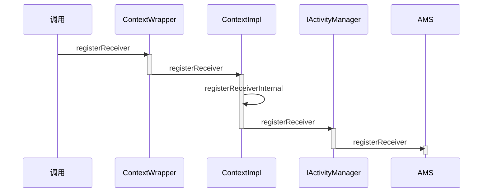
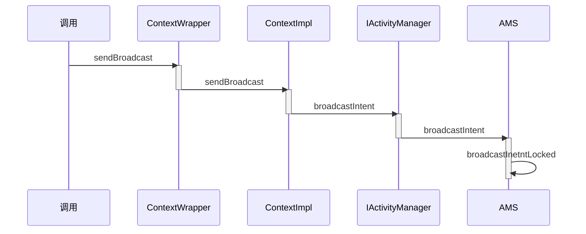
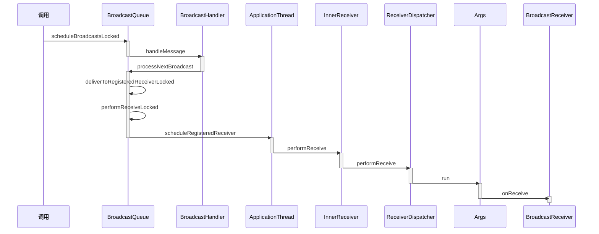

# 广播的注册发送和接收过程

广播作为四大组件之一，使用频率没有Activity这么高，但是广播的工作过程也是有必要了解的，我们将从三个方面讲解广播，分别是注册，发送和接收

## 广播的注册过程

广播的注册就是`广播接收者`注册自己感兴趣的广播，广播的注册分为两种，分别是**动态注册**和**静态注册**

- 静态注册在应用安装的时候由**PackageManagerService**来完成注册过程
- 动态注册的过程是复杂的，时序图如下所示



想要动态注册广播，需要调用**registerReceiver**方法，它在**ContextWrapper**中实现

```java
@Override
public Intent registerReceiver(
        BroadcastReceiver receiver, IntentFilter filter,
        String broadcastPermission, Handler scheduler) {
        return mBase.registerReceiver(receiver, filter, broadcastPermission,
                scheduler);
}
```

mBase具体指向ContextImpl，**ContextImpl.registerReceiver**有很多个重载方法，最后会调用**ContextImpl.registerReceiverInternal**方法

```java
private Intent registerReceiverInternal(BroadcastReceiver receiver, int userId,
            IntentFilter filter, String broadcastPermission,
            Handler scheduler, Context context, int flags) {
        IIntentReceiver rd = null;
        if (receiver != null) {
            //判断LoadedApk类型的mPackageInfo和上下文是否非空
            if (mPackageInfo != null && context != null) {
                if (scheduler == null) {
                    scheduler = mMainThread.getHandler();
                }
                //获得rd，rd是IIntentReceiver类型，是一个Binder接口，用于广播的跨进程通信
                rd = mPackageInfo.getReceiverDispatcher(
                    receiver, context, scheduler,
                    mMainThread.getInstrumentation(), true);
            } else {
                if (scheduler == null) {
                    scheduler = mMainThread.getHandler();
                }
                //没有获得rd的话就创建rd
                rd = new LoadedApk.ReceiverDispatcher(
                        receiver, context, scheduler, null, true).getIIntentReceiver();
            }
        }
        try {
            //调用AMS代理服务的registerReceiver方法，并将rd作为参数传进去
            final Intent intent = ActivityManager.getService().registerReceiver(
                    mMainThread.getApplicationThread(), mBasePackageName, rd, filter,
                    broadcastPermission, userId, flags);
            if (intent != null) {
                intent.setExtrasClassLoader(getClassLoader());
                intent.prepareToEnterProcess();
            }
            return intent;
        } catch (RemoteException e) {
            throw e.rethrowFromSystemServer();
        }
}
```

**rd**在**LoadedApk.ReceiverDispatcher.InnerReceiver**中实现`final static class InnerReceiver extends IIntentReceiver.Stub`

在调用AMS代理服务的registerReceiver方法的时候我们传入了**IIntentReceiver**类型的rd参数，这里我们不直接将广播接收者传递进去是因为注册广播是跨进程的过程，所有需要有有跨进程能力的IIntentReceiverc参与进来

接下来运行到了**ActivityManagerService.registerReceiver**方法

### registerReceiver第一部分

- 通过getRecordForAppLocked方法获得ProcessRecord类型的callerApp变量，该变量用于描述**请求AMS注册广播接收者的Activity所在的应用程序进程**

  ```java
  callerApp = getRecordForAppLocked(caller);
  ```

- 根据传入的**IntentFilter**类型变量**filter**来得到**actions**列表

  ```java
  Iterator<String> actions = filter.actionsIterator();
  ```

- 根据actions列表和userIds来得到所有的**粘性广播的intent**，并且传入到**stickyIntents**中

  ```java
  while (actions.hasNext()) {
          String action = actions.next();
          for (int id : userIds) {
              ArrayMap<String, ArrayList<Intent>> stickies = mStickyBroadcasts.get(id);
              if (stickies != null) {
                  ArrayList<Intent> intents = stickies.get(action);
                  if (intents != null) {
                      if (stickyIntents == null) {
                          stickyIntents = new ArrayList<Intent>();
                      }
                      //将获得的粘性广播的Intent传入到stickyIntents中
                      stickyIntents.addAll(intents);
                  }
              }
          }
      }
  ```

- 遍历寻找匹配的粘性广播,并且存储在**allSticky**中

  ```java
   ArrayList<Intent> allSticky = null;
  if (stickyIntents != null) {
              final ContentResolver resolver = mContext.getContentResolver();
              // 遍历广播
              for (int i = 0, N = stickyIntents.size(); i < N; i++) {
                  Intent intent = stickyIntents.get(i);
                  // Don't provided intents that aren't available to instant apps.
                  if (instantApp &&
                          (intent.getFlags() & Intent.FLAG_RECEIVER_VISIBLE_TO_INSTANT_APPS) == 0) {
                      continue;
                  }
                  //寻找匹配参数的粘性广播
                  if (filter.match(resolver, intent, true, TAG) >= 0) {
                      if (allSticky == null) {
                          allSticky = new ArrayList<Intent>();
                      }
                      allSticky.add(intent);
                  }
              }
          }
  ```

### registerReceiver第二部分

- 获得**ReceiverList**列表，ReceiverList继承于ArrayList，用来存储广播接收者

  ```
  ReceiverList rl = mRegisteredReceivers.get(receiver.asBinder());
  ```

- 如果获得ReceiverList为null，创建ReceiverList

  ```java
  if (rl == null){
  	rl = new ReceiverList(this, callerApp, callingPid, callingUid,userId, receiver);
  }
  ```

- 创建**BroadcastFilter**并将rl传递进去，BroadcastFilter用来描述注册的广播接收者

  ```java
  BroadcastFilter bf = new BroadcastFilter(filter, rl, callerPackage,
                      permission, callingUid, userId, instantApp, visibleToInstantApps);
  ```

- 将BroadcastFilter添加到ReceiverList（将接收者添加到接收者列表）

  ```java
  rl.add(bf);
  ```

- 将**BroadcastFilter**添加到**IntentResolver**类型的**mReceiverResolver**中，当AMS接收到广播的时候可以从mReceiverResolver中找到对应的广播接收者

  ```
  mReceiverResolver.addFilter(bf);
  ```

*当**BroadcastFilter**添加到**IntentResolver**后，完成了广播的注册过程*

## 广播的发送和接收过程

广播的发送和接收分为两个部分，分别是**ContextImpl到AMS**的调用过程和**AMS到BroadcastReceiver**的调用过程

### ContextImpl到AMS的过程

广播的发送有多种类型，**无序广播（普通广播）**，**有序广播**，**粘性广播**

我们以无序广播为例子来解析广播的发送过程，无序广播发送要调用**sendBroadcast**方法，该方法在**ContextWrapper**方法中实现



在**ContextWrapper.sendBroadcast**方法中调用了

```java
mBase.sendBroadcast(intent)
```

mBase指向的是ContextImpl，接下来来到**ContextImpl.sendBroadcast**方法，该方法最后也是通过AMS的代理调用了`ActivityManagerService.broadcastIntent`方法

```java
ActivityManager.getService().broadcastIntent(
                    mMainThread.getApplicationThread(), intent, resolvedType, null,
                    Activity.RESULT_OK, null, null, null, AppOpsManager.OP_NONE, null, false, false,
                    getUserId());
```

在**ActivityManagerService.broadcastIntent**方法中执行了以下逻辑

```java
public final int broadcastIntent(IApplicationThread caller,
            Intent intent, String resolvedType, IIntentReceiver resultTo,
            int resultCode, String resultData, Bundle resultExtras,
            String[] requiredPermissions, int appOp, Bundle bOptions,
            boolean serialized, boolean sticky, int userId) {
        enforceNotIsolatedCaller("broadcastIntent");
        synchronized(this) {
            //验证广播是否合法
            intent = verifyBroadcastLocked(intent);

            final ProcessRecord callerApp = getRecordForAppLocked(caller);
            final int callingPid = Binder.getCallingPid();
            final int callingUid = Binder.getCallingUid();
            final long origId = Binder.clearCallingIdentity();
            //执行broadcastIntentLocked方法
            int res = broadcastIntentLocked(callerApp,
                    callerApp != null ? callerApp.info.packageName : null,
                    intent, resolvedType, resultTo, resultCode, resultData, resultExtras,
                    requiredPermissions, appOp, bOptions, serialized, sticky,
                    callingPid, callingUid, userId);
            Binder.restoreCallingIdentity(origId);
            return res;
        }
    }
```

验证广播合法性执行了以下逻辑

- 判断Intent是否不为null，并且文件描述符不为null，否则抛出*IllegalArgumentException*

  ```java
  if (intent != null && intent.hasFileDescriptors() == true)
  ```

- 获得intent的flag

  ```java
  int flags = intent.getFlags();
  ```

- 如果系统在启动过程中

  ```java
  if (!mProcessesReady)
  ```

  - 执行以下判断

    ```java
    //判断flag是否设置为  启动时只接受动态注册的广播接收者
    if ((flags&Intent.FLAG_RECEIVER_REGISTERED_ONLY_BEFORE_BOOT) != 0) {
       		//不做处理
    //判断flag没有设置为  只接受动态注册的广播接收者
    } else if ((flags&Intent.FLAG_RECEIVER_REGISTERED_ONLY) == 0) {
           Slog.e(TAG, "Attempt to launch receivers of broadcast intent " + intent+ " before boot completion");
        	//抛出错误
           throw new IllegalStateException("Cannot broadcast before boot completed");
    }
    ```

接下来代码执行到`broadcastIntentLocked`方法中，该方法执行了以下逻辑

- 将**动态注册**的广播接收者和**静态注册**的广播接收者按照**优先级顺序存储在不同的列表**中，之后将**两个列表合并到receivers列表**中，这样receivers列表中就包含了所有的广播接收者

- 创建**BroadcastRecord**对象并将receivers传递进去

  ```kava
  BroadcastRecord r = new BroadcastRecord(queue, intent, callerApp,
                      callerPackage, callingPid, callingUid, callerInstantApp, resolvedType,
                      requiredPermissions, appOp, brOptions, registeredReceivers, resultTo,
                      resultCode, resultData, resultExtras, ordered, sticky, false, userId);
  ```

- 调用**BroadcastQueue的scheduleBroadcastsLocked**方法

  ```java
  queue.enqueueParallelBroadcastLocked(r);
  ```

### AMS到BroadcastReceiver的过程



**BroadcastQueue.scheduleBroadcastsLocked**方法中向**BroadcastHandler**类型的**mHandler**发送一个消息，消息类型为**BROADCAST_INTENT_MSG**

```java
mHandler.sendMessage(mHandler.obtainMessage(BROADCAST_INTENT_MSG, this));
```

这个消息在**BroadcastHandler.handleMessage**方法中进行处理

```java
@Override
public void handleMessage(Message msg) {
            switch (msg.what) {
                case BROADCAST_INTENT_MSG: {
                    if (DEBUG_BROADCAST) Slog.v(
                            TAG_BROADCAST, "Received BROADCAST_INTENT_MSG");
                    //调用此处
                    processNextBroadcast(true);
                } break;
                case BROADCAST_TIMEOUT_MSG: {
                    synchronized (mService) {
                        broadcastTimeoutLocked(true);
                    }
                } break;
            }
        }
```

handleMessage方法中调用了**processNextBroadcast**方法，这个方法对无序广播和有序广播分别进行处理，目的是将广播发送给广播接收者，接下来代码来到**processNextBroadcast**方法中

- 判断**fromMsg**参数，我们知道调用**processNextBroadcast**方法的时候传入的**fromMsg**参数为**true**
  - 将mBroadcastsScheduled变量设置为false，表示已经处理了**BROADCAST_INTENT_MSG**消息
  - 遍历存储无序广播的列表`while (mParallelBroadcasts.size() > 0)`
  - 获取无序广播,` r = mParallelBroadcasts.remove(0);`，r变量是**BroadcastRecord**类型
  - 将r变量描述的广播发送给对应的广播接收者
  
    ```java
    deliverToRegisteredReceiverLocked(r, (BroadcastFilter)target, false, i);
    ```

**deliverToRegisteredReceiverLocked**方法会先检查广播发送者和广播接收者的权限，如果通过了权限就会调用

```java
 performReceiveLocked(filter.receiverList.app, filter.receiverList.receiver,
                        new Intent(r.intent), r.resultCode, r.resultData,
                        r.resultExtras, r.ordered, r.initialSticky, r.userId);
```

接下来代码运行到**performReceiveLocked**方法中

- 判断广播接收者所在的应用程序进程**存在并且正在运行**

  ```java
  if (app != null) 
  if (app.thread != null)
  ```

- 使用广播接收者所在应用程序进程来接收广播

  ```java
  app.thread.scheduleRegisteredReceiver(receiver, intent, resultCode,
                              data, extras, ordered, sticky, sendingUser, app.repProcState);
  ```

**app.thread**指的是**ApplicationThread**，接下来我们到了**ApplicationThread.scheduleRegisteredReceiver**方法中
