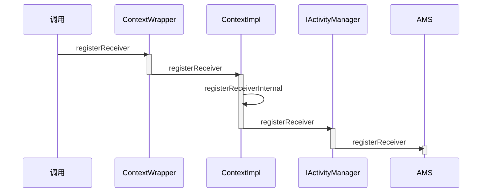

# 广播的注册发送和接收过程

广播作为四大组件之一，使用频率没有Activity这么高，但是广播的工作过程也是有必要了解的，我们将从三个方面讲解广播，分别是注册，发送和接收

## 广播的注册过程

广播的注册就是`广播接收者`注册自己感兴趣的广播，广播的注册分为两种，分别是**动态注册**和**静态注册**

- 静态注册在应用安装的时候由**PackageManagerService**来完成注册过程
- 动态注册的过程是复杂的，时序图如下所示



想要动态注册广播，需要调用**registerReceiver**方法，它在**ContextWrapper**中实现

```java
@Override
public Intent registerReceiver(
        BroadcastReceiver receiver, IntentFilter filter,
        String broadcastPermission, Handler scheduler) {
        return mBase.registerReceiver(receiver, filter, broadcastPermission,
                scheduler);
}
```

mBase具体指向ContextImpl，**ContextImpl.registerReceiver**有很多个重载方法，最后会调用**ContextImpl.registerReceiverInternal**方法

```java
private Intent registerReceiverInternal(BroadcastReceiver receiver, int userId,
            IntentFilter filter, String broadcastPermission,
            Handler scheduler, Context context, int flags) {
        IIntentReceiver rd = null;
        if (receiver != null) {
            //判断LoadedApk类型的mPackageInfo和上下文是否非空
            if (mPackageInfo != null && context != null) {
                if (scheduler == null) {
                    scheduler = mMainThread.getHandler();
                }
                //获得rd，rd是IIntentReceiver类型，是一个Binder接口，用于广播的跨进程通信
                rd = mPackageInfo.getReceiverDispatcher(
                    receiver, context, scheduler,
                    mMainThread.getInstrumentation(), true);
            } else {
                if (scheduler == null) {
                    scheduler = mMainThread.getHandler();
                }
                //没有获得rd的话就创建rd
                rd = new LoadedApk.ReceiverDispatcher(
                        receiver, context, scheduler, null, true).getIIntentReceiver();
            }
        }
        try {
            //调用AMS代理服务的registerReceiver方法，并将rd作为参数传进去
            final Intent intent = ActivityManager.getService().registerReceiver(
                    mMainThread.getApplicationThread(), mBasePackageName, rd, filter,
                    broadcastPermission, userId, flags);
            if (intent != null) {
                intent.setExtrasClassLoader(getClassLoader());
                intent.prepareToEnterProcess();
            }
            return intent;
        } catch (RemoteException e) {
            throw e.rethrowFromSystemServer();
        }
}
```

**rd**在**LoadedApk.ReceiverDispatcher.InnerReceiver**中实现`final static class InnerReceiver extends IIntentReceiver.Stub`

在调用AMS代理服务的registerReceiver方法的时候我们传入了**IIntentReceiver**类型的rd参数，这里我们不直接将广播接收者传递进去是因为注册广播是跨进程的过程，所有需要有有跨进程能力的IIntentReceiverc参与进来

接下来运行到了**ActivityManagerService.registerReceiver**方法

### registerReceiver第一部分

- 通过getRecordForAppLocked方法获得ProcessRecord类型的callerApp变量，该变量用于描述**请求AMS注册广播接收者的Activity所在的应用程序进程**

  ```java
  callerApp = getRecordForAppLocked(caller);
  ```

- 根据传入的**IntentFilter**类型变量**filter**来得到**actions**列表

  ```java
  Iterator<String> actions = filter.actionsIterator();
  ```

- 根据actions列表和userIds来得到所有的**粘性广播的intent**，并且传入到**stickyIntents**中

  ```java
  while (actions.hasNext()) {
          String action = actions.next();
          for (int id : userIds) {
              ArrayMap<String, ArrayList<Intent>> stickies = mStickyBroadcasts.get(id);
              if (stickies != null) {
                  ArrayList<Intent> intents = stickies.get(action);
                  if (intents != null) {
                      if (stickyIntents == null) {
                          stickyIntents = new ArrayList<Intent>();
                      }
                      //将获得的粘性广播的Intent传入到stickyIntents中
                      stickyIntents.addAll(intents);
                  }
              }
          }
      }
  ```

- 遍历寻找匹配的粘性广播,并且存储在**allSticky**中

  ```java
   ArrayList<Intent> allSticky = null;
  if (stickyIntents != null) {
              final ContentResolver resolver = mContext.getContentResolver();
              // 遍历广播
              for (int i = 0, N = stickyIntents.size(); i < N; i++) {
                  Intent intent = stickyIntents.get(i);
                  // Don't provided intents that aren't available to instant apps.
                  if (instantApp &&
                          (intent.getFlags() & Intent.FLAG_RECEIVER_VISIBLE_TO_INSTANT_APPS) == 0) {
                      continue;
                  }
                  //寻找匹配参数的粘性广播
                  if (filter.match(resolver, intent, true, TAG) >= 0) {
                      if (allSticky == null) {
                          allSticky = new ArrayList<Intent>();
                      }
                      allSticky.add(intent);
                  }
              }
          }
  ```

### registerReceiver第二部分

- 获得**ReceiverList**列表，ReceiverList继承于ArrayList，用来存储广播接收者

  ```
  ReceiverList rl = mRegisteredReceivers.get(receiver.asBinder());
  ```

- 如果获得ReceiverList为null，创建ReceiverList

  ```java
  if (rl == null){
  	rl = new ReceiverList(this, callerApp, callingPid, callingUid,userId, receiver);
  }
  ```

- 创建**BroadcastFilter**并将rl传递进去，BroadcastFilter用来描述注册的广播接收者

  ```java
  BroadcastFilter bf = new BroadcastFilter(filter, rl, callerPackage,
                      permission, callingUid, userId, instantApp, visibleToInstantApps);
  ```

- 将BroadcastFilter添加到ReceiverList（将接收者添加到接收者列表）

  ```java
  rl.add(bf);
  ```

- 将**BroadcastFilter**添加到**IntentResolver**类型的**mReceiverResolver**中，当AMS接收到广播的时候可以从mReceiverResolver中找到对应的广播接收者

  ```
  mReceiverResolver.addFilter(bf);
  ```

*当**BroadcastFilter**添加到**IntentResolver**后，完成了广播的注册过程*