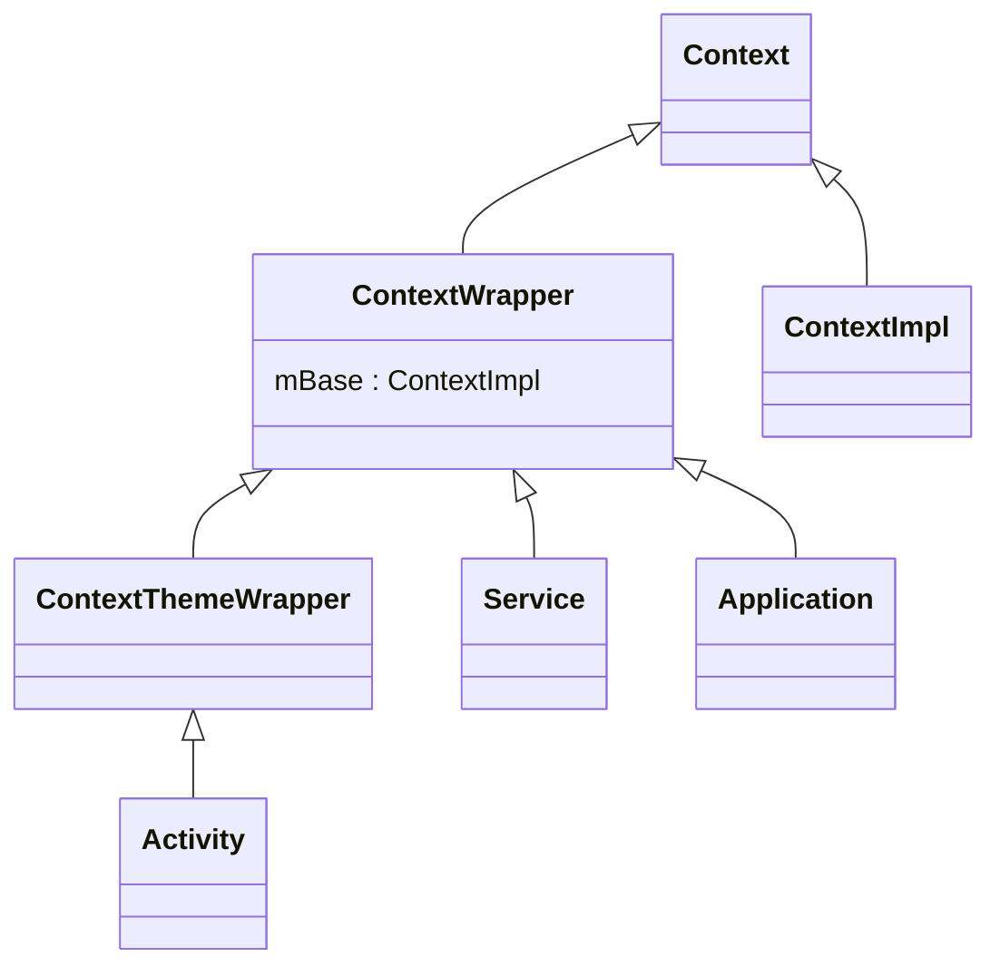
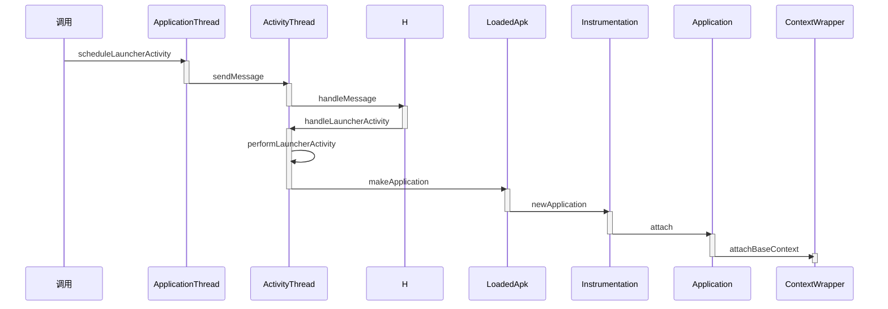
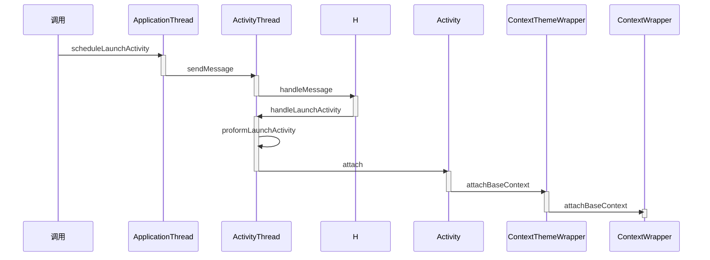

> Context就是上下文对象，是Android常用的类
>
> 四大组件都会涉及到Context，理解了Context会更有助于学习四大组件的原理

# Context的关联类

Context是一个**应用程序环境信息的接口**，在开发过程中我们经常使用Context，其使用场景分为两大类

- 使用Context调用方法，比如启动Activity，访问资源，调用系统服务都是需要通过Context调用
- 调用方法时传入Context，比如创建Dialog或弹Toast

Activity，Service，Application都间接继承于Context，我们可以计算出一个应用程序进程有多少个Context， 该数量等同于Activity和Service的总数+1，额外的+1是Application

**Context是一个抽象类**，其内部定义了很多的方法和静态变量，该抽象类的具体实现为**ContextImpl**

和Context关联的类，除了ContextImpl还有ContextWrapper，ContextThemeWrapper和Activity等，具体关系如下



ContextImpl和ContextWrapper都继承于Context

ContextWrapper内部包含了Context类型的mBase对象，mBase具体指向ContextImpl

ContextImpl提供了很多功能，但是外界需要**使用并扩展**ContextImpl的功能，因此使用了装饰器模式

> *装饰器模式（Decorator Pattern）允许向一个现有的对象添加新的功能，同时又不改变其结构。这种类型的设计模式属于结构型模式，它是作为现有的类的一个包装。*

**ContextWrapper就是装饰类**，该类对ContextImpl进行了包装，**起到了方法传递的作用**，ContextWrapper类中的所有方法基本都是调用ContextImpl的相对应方法来实现的

ContextThemeWrapper，Service，Application都是继承于ContextWrapper，这样他们都可以通过mBase来使用Context方法，同时自身也是装饰类，可以在ContextWrapper的基础上添加不同的功能

Context的关联类采用了装饰模式，主要有以下优点

- 使用者（如Service）能方便地使用Context
- 如果ContextImpl发生了变化，装饰类ContextWrapper也不需要做任何修改
- ContextImpl的实现不会暴露给使用者，使用者也不需要关系实现
- 通过组合而非继承的方式拓展ContextImpl的功能，运行时选择不同的装饰类，实现不同的功能

为了理解Context的关联类的设计理念，需要理解Application,Activity,Service的Context创建过程

# Application Context的创建过程

我们通常使用**getApplicationContext**方法来获取应用程序全局的ApplicationContxt

在应用程序启动完成后，应用程序就会有一个全局的ApplicationContext

创建过程的时序图如下



ActivityThread作为应用程序进程的主线程管理类，会调用其内部类ApplicationThread的**scheduleLauncherActivity**方法来启动Activity

在scheduleLauncherActivity方法中执行了以下代码

```java
sendMessage(H.LAUNCH_ACTIVITY, r);
```

ApplicationThread的**scheduleLauncherActivity**方法中向着H类发送了**LAUNCH_ACTIVITY**类型的消息，目的是将启动的Activity的逻辑

放在主线程的消息队列中，**这样启动Activity的逻辑会在主线程中执行**

H类的**handleMessage**方法中接收消息，接收到**LAUNCH_ACTIVITY**类型的消息会执行

```java
case LAUNCH_ACTIVITY: {
    Trace.traceBegin(Trace.TRACE_TAG_ACTIVITY_MANAGER, "activityStart");
    final ActivityClientRecord r = (ActivityClientRecord) msg.obj;
    //
	r.packageInfo = getPackageInfoNoCheck(r.activityInfo.applicationInfo, r.compatInfo);
    //
	handleLaunchActivity(r, null, "LAUNCH_ACTIVITY");
	Trace.traceEnd(Trace.TRACE_TAG_ACTIVITY_MANAGER);
}
```

H类继承于Handler是ActivityThread的内部类，通过getPackageInfoNoCheck方法来获得**LoadedApk**类型的对象，并将该对象赋值给了**ActivityClientRecord**的**packageInfo**变量， LoadedApk是用来描述已加载的APK文件

之后调用了**ActivityThread.handleLaunchActivity**方法

```java
Activity a = performLaunchActivity(r, customIntent);
```

handleLaunchActivity又调用了**performLaunchActivity**方法，获得了一个Activity对象

```java
Application app = r.packageInfo.makeApplication(false, mInstrumentation);
```

在performLaunchActivity方法中有很多重要逻辑，和Context相关的逻辑就是调用了**ActivityClientRecord**类型的r对象的成员变量**packageInfo**的**makeApplication**方法，packageInfo是LoadedApk类型，接下来来到**LoadedApk.makeApplication**方法中

- 判断mApplication变量是否为空（也就是是否第一次启动），如果不为空就返回mApplication变量，为空就继续向下执行

  ```java
  if (mApplication != null) {
  	return mApplication;
  }
  ```

- 使用ContextImpl的createAppContext方法创建ContextImpl

  ```java
  ContextImpl appContext = ContextImpl.createAppContext(mActivityThread, this);
  ```

- 创建Application

  ```java
  app = mActivityThread.mInstrumentation.newApplication(cl, appClass, appContext);
  ```

- 设置ContextImpl的context类型的mOuterContext变量为之前创建的Application类型app对象，**让ContextImpl保持对Application的引用**

  ```java
  appContext.setOuterContext(app);
  ```

- 将创建Application对象app保存为LoadedApk的成员变量mApplication，用来表示ApplicationContext

  ```java
  mApplication = app;
  ```

**接下来来到Instrumentation的newApplication方法**，该方法有两个重载方法

```java
public Application newApplication(ClassLoader cl, String className, Context context)
            throws InstantiationException, IllegalAccessException, 
            ClassNotFoundException {
		//使用传递进来的类加载器，加载className参数的类然后将该类和context作为参数传递到下一个重载方法
        return newApplication(cl.loadClass(className), context);
    }

static public Application newApplication(Class<?> clazz, Context context)
            throws InstantiationException, IllegalAccessException, 
            ClassNotFoundException {
        //实例化加载器生成的类，并强制转换为Application类型
        Application app = (Application)clazz.newInstance();
		//将ContextImpl传进去
        app.attach(context);
        return app;
    }
```

调用了Application的attach方法，并将ContextImpl作为参数传递进去

```java
final void attach(Context context) {
        attachBaseContext(context);
        mLoadedApk = ContextImpl.getImpl(context).mPackageInfo;
    }
```

在Application.attach方法中调用了**attachBaseContext**方法，**该方法在Application的父类ContextWrapper类中实现**

```java
protected void attachBaseContext(Context base) {
        if (mBase != null) {
            throw new IllegalStateException("Base context already set");
        }
        mBase = base;
    }
```

base指的就是ContextImpl，是Context的实现类

将ContextImpl赋值给ContextWrapper的成员变量**mBase**，这样就可以在ContextWrapper中使用Context的方法

Application继承于ContextWrapper，同样也可以使用Context方法

Application的attach方法的作用就是使Application可以使用Context方法，这样Application可以用来代表ApplicationContext

# Application Context的获取过程

我们已经了解了Application Context的创建过程，其获取过程也很好理解

我们使用**getApplicationContext**方法来获得Application Context ，该方法在**ContextWrapper**中实现

```java
@Override
public Context getApplicationContext() {
        return mBase.getApplicationContext();
    }
```

base是ContextImpl，我们来到**ContextImpl.getApplicationContext**方法中

```java
@Override
public Context getApplicationContext() {
        return (mPackageInfo != null) ?
                mPackageInfo.getApplication() : mMainThread.getApplication();
    }
```

如果LoadedApk类型的mPackageInfo对象不null，那就返回**LoadedApk.getApplication**，不然返回**ActivityThread.getApplication**

由于程序已经启动了，LoadedApk不会为null，所以调用了`LoadedApk.getApplication()`方法

```java
Application getApplication() {
        return mApplication;
    }
```

**该方法返回了之前makeApplication方法中赋值了Context的全局变量mApplication**，于是便获得了Context

# Activity Context的创建过程

想要在Activity中使用Context提供的方法，首先需要创建Context，Activity的Context会在Activity启动的过程中被创建

*Activity的Context创建的时序图*



ActivityThread是应用程序进程的主线程管理类，其内部类ApplicationThread会**调用scheduleLaunchActivity方法来启动Activity**

- **scheduleLaunchActivity**方法将启动Activity的参数封装为**ActivityClientRecord**对象

  ```java
  ActivityClientRecord r = new ActivityClientRecord();
  ```

- 使用**sendMessage**向H类发送**H.LAUNCH_ACTIVITY**类型的消息，并且将ActivityClientRecord对象传进去

  ```java
  sendMessage(H.LAUNCH_ACTIVITY, r);
  ```

  该方法的主要目的是将启动Activity的逻辑放在主线程中执行

  H类的**HandleMessgae**方法会对**LAUNCH_ACTIVITY**类型的消息进行处理，消息处理时的调用链为

  ```mermaid
  flowchart LR
  	H.handleMessage --> ActivityThread.handleLaunchActivity
  	ActivityThread.handleLaunchActivity --> ActivityThread.performLaunchActivity
  ```

接下来来到**ActivityThread.performLaunchActivity**方法

- 使用**createBaseContextForActivity**方法创建Activity的ContextImpl

  ```java
  ContextImpl appContext = createBaseContextForActivity(r);
  ```

- 创建Activity的实例

  ```java
  activity = mInstrumentation.newActivity(cl, component.getClassName(), r.intent);
  ```

- 将创建的Activity设置给ContextImpl的**mOuterContext**变量，让ContextImpl也有访问Activity的能力

  ```java
  appContext.setOuterContext(activity);
  ```

- 将ContextImpl传入Activity的attach方法

  ```java
  activity.attach(appContext, this, getInstrumentation(), r.token,
                          r.ident, app, r.intent, r.activityInfo, title, r.parent,
                          r.embeddedID, r.lastNonConfigurationInstances, config,
                          r.referrer, r.voiceInteractor, window, r.configCallback);
  ```

- 调用mInstrumentation的callActivityOnCreate方法从而调用Activity的Create方法

  ```java
  mInstrumentation.callActivityOnCreate(activity, r.state, r.persistentState);
  ```

查看**performLaunchActivity方法中创建Activity的ContextImpl的createBaseContextForActivity**方法发现，该方法调用了ContextImpl的**createActivityContext**方法来创建ContextImpl

```java
 ContextImpl appContext = ContextImpl.createActivityContext(
                this, r.packageInfo, r.activityInfo, r.token, displayId, r.overrideConfig);
```

接下来回到performLaunchActivity方法中的**调用activity.attach方法**

- 调用**attachBaseContext**方法，该方法在**ContextThemeWrapper**中实现

  ```java
  attachBaseContext(context);
  ```

- 创建PhoneWindow，也就是应用程序窗口，PhoneWindow在运行的时候会间接触发很多事件，点击或屏幕焦点变化，这些事件需要转发给和PhoneWindow关联的Activity

  ```java
  mWindow = new PhoneWindow(this, window, activityConfigCallback);
  ```

- 将当前Activity通过**setCallback**设置给PhoneWindow

  ```java
  mWindow.setCallback(this);
  ```

- 为PhoneWindow设置WindowManager

  ```java
  mWindow.setWindowManager(
                  (WindowManager)context.getSystemService(Context.WINDOW_SERVICE),
                  mToken, mComponent.flattenToString(),
                  (info.flags & ActivityInfo.FLAG_HARDWARE_ACCELERATED) != 0);
  ```

- 获得WIndowManager并且赋值给Activity的成员变量**mWindowManager**

  ```java
  mWindowManager = mWindow.getWindowManager();
  ```

**接下来来到attachBaseContext方法中**，该方法调用的是**ContextThemeWrapper.attachBaseContext**

```java
@Override
protected void attachBaseContext(Context newBase) {
        super.attachBaseContext(newBase);
    }
```

这个方法调用的是其父类的同名方法

```java
protected void attachBaseContext(Context base) {
        if (mBase != null) {
            throw new IllegalStateException("Base context already set");
        }
        mBase = base;
    }
```

这里的base就是一路传进来的Activity的ContextImpl

赋值给了ContextWrapper的变量mBase，这样ContextWrapper的功能就可以交给ContextImpl来处理

> 比如调用Activity的getResources方法，就是调用了ContextImpl的getResources方法
>
> ```java
> @Override
> public Resources getResources() {
>         return mBase.getResources();
>     }
> ```

ActivityContext的创建过程可以总结为以下几点

1. 启动Activity的过程中创建ContextImpl
2. 将创建的ContextImpl赋值给ContextWrapper的成员变量mBase
3. Activity继承自ContextWrapper的子类ContextThemeWrapper，这样Activity中就可以使用Context中定义的方法

# Service的Context创建过程
