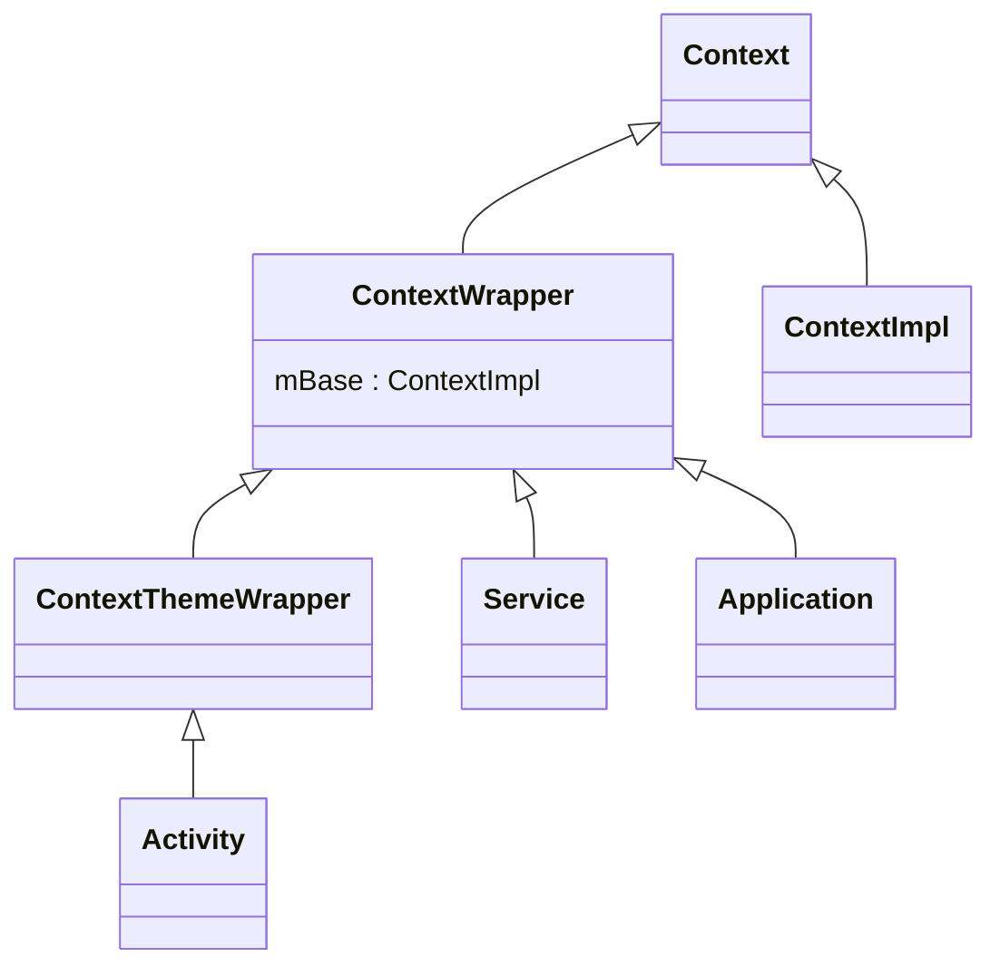
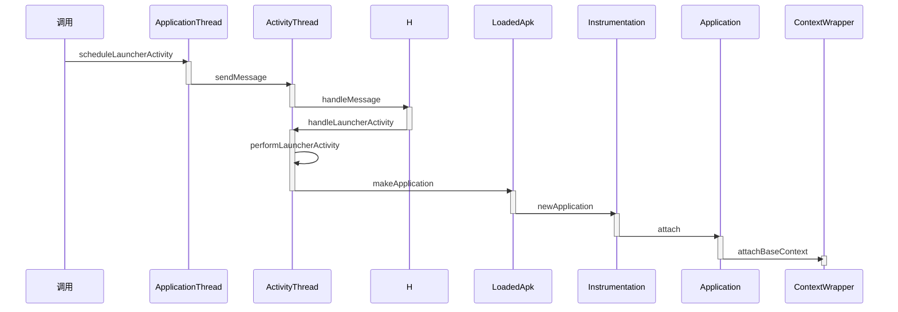

> Context就是上下文对象，是Android常用的类
>
> 四大组件都会涉及到Context，理解了Context会更有助于学习四大组件的原理

# Context的关联类

Context是一个**应用程序环境信息的接口**，在开发过程中我们经常使用Context，其使用场景分为两大类

- 使用Context调用方法，比如启动Activity，访问资源，调用系统服务都是需要通过Context调用
- 调用方法时传入Context，比如创建Dialog或弹Toast

Activity，Service，Application都间接继承于Context，我们可以计算出一个应用程序进程有多少个Context， 该数量等同于Activity和Service的总数+1，额外的+1是Application

**Context是一个抽象类**，其内部定义了很多的方法和静态变量，该抽象类的具体实现为**ContextImpl**

和Context关联的类，除了ContextImpl还有ContextWrapper，ContextThemeWrapper和Activity等，具体关系如下

ContextImpl和ContextWrapper都继承于Context

ContextWrapper内部包含了Context类型的mBase对象，mBase具体指向ContextImpl

ContextImpl提供了很多功能，但是外界需要**使用并扩展**ContextImpl的功能，因此使用了装饰器模式

> *装饰器模式（Decorator Pattern）允许向一个现有的对象添加新的功能，同时又不改变其结构。这种类型的设计模式属于结构型模式，它是作为现有的类的一个包装。*

**ContextWrapper就是装饰类**，该类对ContextImpl进行了包装，**起到了方法传递的作用**，ContextWrapper类中的所有方法基本都是调用ContextImpl的相对应方法来实现的

ContextThemeWrapper，Service，Application都是继承于ContextWrapper，这样他们都可以通过mBase来使用Context方法，同时自身也是装饰类，可以在ContextWrapper的基础上添加不同的功能

Context的关联类采用了装饰模式，主要有以下优点

- 使用者（如Service）能方便地使用Context
- 如果ContextImpl发生了变化，装饰类ContextWrapper也不需要做任何修改
- ContextImpl的实现不会暴露给使用者，使用者也不需要关系实现
- 通过组合而非继承的方式拓展ContextImpl的功能，运行时选择不同的装饰类，实现不同的功能

为了理解Context的关联类的设计理念，需要理解Application,Activity,Service的Context创建过程

# ApplicationContext的创建过程

我们通常使用**getApplicationContext**方法来获取应用程序全局的ApplicationContxt

在应用程序启动完成后，应用程序就会有一个全局的ApplicationContext

创建过程的时序图如下

ActivityThread作为应用程序进程的主线程管理类，会调用其内部类ApplicationThread的scheduleLauncherActivity方法来启动Activity

