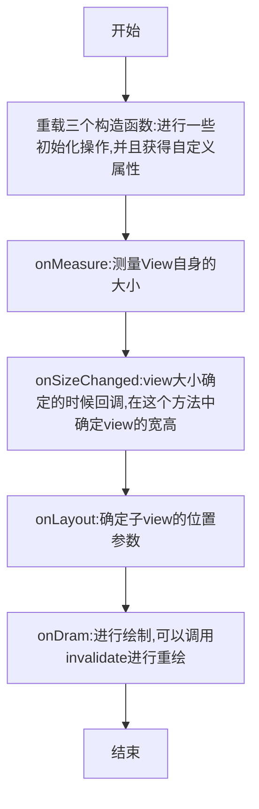

# 自定义View的流程

```mermaid
graph TD;
	开始 --> 重载三个构造函数:进行一些初始化操作,并且获得自定义属性
	重载三个构造函数:进行一些初始化操作,并且获得自定义属性 --> onMeasure:测量View自身的大小
	onMeasure:测量View自身的大小 --> onSizeChanged:view大小确定的时候回调,在这个方法中确定view的宽高
	onSizeChanged:view大小确定的时候回调,在这个方法中确定view的宽高 --> onLayout:确定子view的位置参数
	onLayout:确定子view的位置参数 --> onDram:进行绘制,可以调用invalidate进行重绘
	onDram:进行绘制,可以调用invalidate进行重绘 --> 结束
```

不同类型的View绘制流程不同
