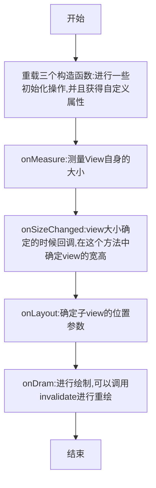

# 自定义View的流程



## 自定义View有三个要点，布局，绘制，触摸反馈

自定义View的绘制在onDraw方法中完成

使用Canvas的一些方法来进行绘制

配合上范围变换和几何裁切来达到效果

# Example

## 自定义绘制一个填写验证码的控件

效果如下所示


制作该控件的目的在于**显目地告知用户输入的验证码**，如果做成原生的EditText样式并不是很美观

**该组件的原理是使用4个Text显示用户输入的数字，采用一个隐形的EditText来获取用户的输入**

**代码如下所示**

```kotlin
package org.phcbest.neteasymusic.ui.widget.custom

import android.content.Context
import android.text.Editable
import android.text.TextWatcher
import android.util.AttributeSet
import android.view.View
import android.widget.EditText
import android.widget.RelativeLayout
import android.widget.TextView
import org.phcbest.neteasymusic.R

class VerifyCodeView : RelativeLayout {

    private var editText: EditText? = null
    private var textViews: MutableList<TextView>? = arrayListOf()
    private var MAX: Int = 4
    private var inputContent: String? = null

    constructor(context: Context?) : this(context, null)

    constructor(context: Context?, attrs: AttributeSet?) : this(context, attrs, 0)

    constructor(context: Context?, attrs: AttributeSet?, defStyleAttr: Int) : super(
        context,
        attrs,
        defStyleAttr
    ) {
        View.inflate(context, R.layout.custom_verify_code_view, this)
        textViews?.add(0, findViewById(R.id.tv_verify_0))
        textViews?.add(1, findViewById(R.id.tv_verify_1))
        textViews?.add(2, findViewById(R.id.tv_verify_2))
        textViews?.add(3, findViewById(R.id.tv_verify_3))
//        textViews?.add(4, findViewById(R.id.tv_verify_4))
//        textViews?.add(5, findViewById(R.id.tv_verify_5))
        editText = findViewById(R.id.et_verify_code_input)

        setEditTextListener()
    }

    private fun setEditTextListener() {
        editText?.addTextChangedListener(object : TextWatcher {
            override fun beforeTextChanged(s: CharSequence?, start: Int, count: Int, after: Int) {
            }

            override fun onTextChanged(s: CharSequence?, start: Int, before: Int, count: Int) {
            }

            override fun afterTextChanged(s: Editable?) {
                inputContent = editText?.text.toString()
                if (inputCompleteListener != null) {
                    if (inputContent!!.length >= MAX) {
                        inputCompleteListener!!.inputComplete()
                    } else {
                        inputCompleteListener!!.invalidComplete()
                    }
                }
                for (index in 0 until MAX) {
                    if (index < inputContent!!.length) {
                        textViews?.get(index)?.text = inputContent!![index].toString()
                    } else {
                        textViews?.get(index)?.text = ""
                    }
                }
            }
        })
    }

    private var inputCompleteListener: InputCompleteListener? = null
    public fun setInputCompleteListener(inputCompleteListener: InputCompleteListener) {
        this.inputCompleteListener = inputCompleteListener
    }

    public interface InputCompleteListener {
        fun inputComplete()
        fun invalidComplete()
    }


    public fun getEditContent(): String {
        return inputContent!!
    }

}
```

重写了三个构造方法，这是自定义View必须的，最后代码会执行到

```kotlin
constructor(context: Context?, attrs: AttributeSet?, defStyleAttr: Int)
```

在该方法中，首先绑定了一个xml文件到View中

```kotlin
View.inflate(context, R.layout.custom_verify_code_view, this)
```

然后将该View中的几个TextView实例添加到TextView集合中

```kotlin
textViews?.add(0, findViewById(R.id.tv_verify_0))
textViews?.add(1, findViewById(R.id.tv_verify_1))
textViews?.add(2, findViewById(R.id.tv_verify_2))
textViews?.add(3, findViewById(R.id.tv_verify_3))
```

之后找到View中的EditText对象

```kotlin
editText = findViewById(R.id.et_verify_code_input)
```

之后对editText设置了文字改变监听

```kotlin
 editText?.addTextChangedListener(object : TextWatcher {
            override fun beforeTextChanged(s: CharSequence?, start: Int, count: Int, after: Int) {
            }

            override fun onTextChanged(s: CharSequence?, start: Int, before: Int, count: Int) {
            }
			//文本改变后回调
            override fun afterTextChanged(s: Editable?) {
                //获得用户的输入
                inputContent = editText?.text.toString()
                //判断接口回调变量是否为null
                if (inputCompleteListener != null) {
                    //如果用户输入的长度为完成长度
                    if (inputContent!!.length >= MAX) {
                        //调用完成回调
                        inputCompleteListener!!.inputComplete()
                    } else {
                        //调用未完成回调
                        inputCompleteListener!!.invalidComplete()
                    }
                }
                //设置TextView显示用户输入
                for (index in 0 until MAX) {
                    if (index < inputContent!!.length) {
                        textViews?.get(index)?.text = inputContent!![index].toString()
                    } else {
                        textViews?.get(index)?.text = ""
                    }
                }
            }
        })
```

被绑定进View的布局**R.layout.custom_verify_code_view**如下所示

```xml
<?xml version="1.0" encoding="utf-8"?>
<layout xmlns:android="http://schemas.android.com/apk/res/android">

    <RelativeLayout
        android:layout_width="match_parent"
        android:layout_height="wrap_content">
		
       <!--用户输入的文字-->
        <LinearLayout
            android:layout_width="match_parent"
            android:layout_height="48dp"
            android:gravity="center"
            android:orientation="horizontal">

            <TextView
                android:id="@+id/tv_verify_0"
                style="@style/verify_code_tv" />

            <View
                android:layout_width="0dp"
                android:layout_height="wrap_content"
                android:layout_weight="1" />

            <TextView
                android:id="@+id/tv_verify_1"
                style="@style/verify_code_tv" />

            <View
                android:layout_width="0dp"
                android:layout_height="wrap_content"
                android:layout_weight="1" />

            <TextView
                android:id="@+id/tv_verify_2"
                style="@style/verify_code_tv" />

            <View
                android:layout_width="0dp"
                android:layout_height="wrap_content"
                android:layout_weight="1" />

            <TextView
                android:id="@+id/tv_verify_3"
                style="@style/verify_code_tv" />

        </LinearLayout>

        <!--数字底下的红线-->
        <LinearLayout
            android:layout_width="match_parent"
            android:layout_height="48dp"
            android:gravity="center"
            android:orientation="horizontal">

            <View
                android:layout_width="41dp"
                android:layout_height="2dp"
                android:layout_gravity="bottom"
                android:background="@color/easy_red" />

            <View
                android:layout_width="0dp"
                android:layout_height="wrap_content"
                android:layout_weight="1" />

            <View
                android:layout_width="41dp"
                android:layout_height="2dp"
                android:layout_gravity="bottom"
                android:background="@color/easy_red" />

            <View
                android:layout_width="0dp"
                android:layout_height="wrap_content"
                android:layout_weight="1" />

            <View
                android:layout_width="41dp"
                android:layout_height="2dp"
                android:layout_gravity="bottom"
                android:background="@color/easy_red" />

            <View
                android:layout_width="0dp"
                android:layout_height="wrap_content"
                android:layout_weight="1" />

            <View
                android:layout_width="41dp"
                android:layout_height="2dp"
                android:layout_gravity="bottom"
                android:background="@color/easy_red" />

        </LinearLayout>

		<!--自定义EditText来接收用户输入-->
        <org.phcbest.neteasymusic.ui.widget.custom.VeriftyEditText
            android:id="@+id/et_verify_code_input"
            android:layout_width="match_parent"
            android:layout_height="48dp"
            android:background="#00000000"
            android:cursorVisible="false"
            android:inputType="number"
            android:longClickable="false"
            android:maxLength="4"
            android:textColor="#00000000" />

    </RelativeLayout>
</layout>
```

我使用了一个自定义的EditText来获得用户的输入，主要是修改了**光标变更的监听**和**点击监听**

```kotlin
package org.phcbest.neteasymusic.ui.widget.custom

import android.content.Context
import android.util.AttributeSet
import android.view.MotionEvent
import androidx.appcompat.widget.AppCompatEditText

class VeriftyEditText : AppCompatEditText {
    private var lastTime: Long = 0

    constructor(context: Context) : super(context)
    constructor(context: Context, attrs: AttributeSet?) : super(context, attrs)
    constructor(context: Context, attrs: AttributeSet?, defStyleAttr: Int) : super(
        context,
        attrs,
        defStyleAttr
    )

    override fun onSelectionChanged(selStart: Int, selEnd: Int) {
        super.onSelectionChanged(selStart, selEnd)
        //在选择更改时,将光标移动到最后一个位置
        this.setSelection(this.text!!.length)
    }

    override fun onTouchEvent(event: MotionEvent?): Boolean {
        when (event!!.action) {
            MotionEvent.ACTION_DOWN -> {
                val currentTime = System.currentTimeMillis()
                if (currentTime - lastTime < 500) {
                    lastTime = currentTime
                    return true
                } else {
                    lastTime = currentTime
                }
            }
        }
        return super.onTouchEvent(event)
    }
}
```

当用户企图修改光标位置的时候，我们将光标位置移动到最后，用来**防止输入紊乱**

在onTouchEvent中，我们让用户的长按操作失效，以防止用户长按看到了真实的EditText位置，影响UI体验

## 带环形进度条的播放/暂停按钮

效果如下所示


中间的播放和暂停由**drawBitmap**方法绘制，外围的进度是绘制了两个大小相同的圆圈，一个是使用**drawCircle**绘制圆形，一个是使用**drawArc**来绘制弧形，源码如下所示

```kotlin
package org.phcbest.neteasymusic.ui.widget.playBar

import android.content.Context
import android.graphics.*
import android.util.AttributeSet
import android.util.Log
import android.view.View
import androidx.annotation.FloatRange
import androidx.annotation.IntRange
import androidx.core.graphics.drawable.toBitmap
import org.phcbest.neteasymusic.R


private const val TAG = "PlayBarProgressButton"

class PlayBarProgressButton : View {
    private var mContext: Context? = null

    private var mCirclePaint: Paint = Paint()
    private var mProgressPaint: Paint = Paint()


    private var mBmRect: Rect = Rect()
    private var mBmPaint: Paint = Paint()
    private var mBm: Bitmap? = null
    private var mPlayBm: Bitmap? = null
    private var mPauseBm: Bitmap? = null

    private var mSweepAngle: Float = 0F

    constructor(context: Context) : this(context, null)

    constructor(context: Context, attributeSet: AttributeSet?) : this(context, attributeSet, 0)

    constructor(context: Context, attributeSet: AttributeSet?, defStyleAttr: Int) : super(
        context,
        attributeSet,
        defStyleAttr
    ) {
        this.mContext = context
        init()
    }

    private fun init() {
        //设置圆形画笔
        mCirclePaint.isAntiAlias = true
        mCirclePaint.color = Color.parseColor("#88888888")
        mCirclePaint.style = Paint.Style.STROKE
        mCirclePaint.strokeWidth = 3f
        //设置进度弧形画笔
        mProgressPaint.isAntiAlias = true //抗锯齿
        mProgressPaint.color = Color.parseColor("#000000")
        mProgressPaint.style = Paint.Style.STROKE
        mProgressPaint.strokeWidth = 4f
        //初始化bitmap,设置默认状态为暂停,播放的ui状态要显示为暂停,所以反过来
        mPlayBm = resources.getDrawable(R.drawable.ic_play_bar_pause, null).toBitmap()
        mPauseBm = resources.getDrawable(R.drawable.ic_play_bar_play, null).toBitmap()
        pause()
    }


    override fun onMeasure(widthMeasureSpec: Int, heightMeasureSpec: Int) {
        super.onMeasure(widthMeasureSpec, heightMeasureSpec)
        val size = MeasureSpec.getSize(widthMeasureSpec)
        Log.i(TAG, "onMeasure: $size")
        //描述一个矩形位置
    }


    override fun onDraw(canvas: Canvas) {
        super.onDraw(canvas)
        val widthHalf = (width / 2).toFloat()
        val heightHalf = (height / 2).toFloat()
        val radius = (width.coerceAtMost(height) / 2) - 3.toFloat()//因为画笔自带3f厚度,需要减掉
//        Log.i(TAG, "onDraw: $widthHalf,$heightHalf,$radius")
        //绘制圆圈
        canvas.drawCircle(
            widthHalf,
            heightHalf,
            radius,
            mCirclePaint
        )

        //绘制进度弧形,计算矩形大小使用公式(宽度)
        canvas.drawArc(
            widthHalf - radius,
            heightHalf - radius,
            width - (widthHalf - radius),
            height - (heightHalf - radius),
            -90F,
            mSweepAngle,
            false,
            mProgressPaint
        )
        //绘制状态按钮,需要矩形和view的2/3大
        mBmRect.set(
            (widthHalf / 2).toInt() + 5,
            (heightHalf / 2).toInt(),
            (widthHalf + widthHalf / 2).toInt(),
            (heightHalf + heightHalf / 2).toInt()
        )
        mBmPaint.isAntiAlias = true
        canvas.drawBitmap(mBm!!, null, mBmRect, mBmPaint)
    }

    /**
     * 播放
     */
    fun play() {
        mBm = mPlayBm
//        mProgressCDT?.resume()
        invalidate()
    }

    /**
     * 暂停
     */
    fun pause() {
        mBm = mPauseBm
//        mProgressCDT?.pause()
        invalidate()
    }

    /**
     * 复位进度
     */
    fun resetProgress() {
//        mProgressCDT?.cancel()
//        mProgressCDT?.start()?.pause()
        updateProgress(0F)
    }


    /**
     * 进度更新
     */
    fun updateProgress(@FloatRange(from = 0.0, to = 100.0) progress: Float) {
        this.mSweepAngle = 3.6F * progress
//        Log.i(TAG, "更新进度为: ${(3.6 * progress).toFloat()}")
        invalidate()
    }

}
```

可以看到我在init方法中初始化了画笔的一些参数

绘制圆圈的画笔参数，绘制弧形的画笔参数设置也差不多

```kotlin
//设置抗锯齿
mCirclePaint.isAntiAlias = true
//设置颜色
mCirclePaint.color = Color.parseColor("#88888888")
//设置style为STROKE，就是绘制空心圆
mCirclePaint.style = Paint.Style.STROKE
//空心圆的宽度
mCirclePaint.strokeWidth = 3f
```

更新进度的是否只需要改变弧形的结束角度之后调用invalidate方法刷新即可

```kotlin
fun updateProgress(@FloatRange(from = 0.0, to = 100.0) progress: Float) {
        this.mSweepAngle = 3.6F * progress
//        Log.i(TAG, "更新进度为: ${(3.6 * progress).toFloat()}")
        invalidate()
    }
```

## 实现一个可以旋转的圆形ImageView

效果如下所示


这个Image可以随着播放旋转，随着暂停停止旋转

```kotlin
package org.phcbest.neteasymusic.ui.widget.playDisc

import android.animation.ObjectAnimator
import android.content.Context
import android.graphics.Bitmap
import android.graphics.Canvas
import android.graphics.Paint
import android.graphics.Rect
import android.graphics.drawable.Drawable
import android.util.AttributeSet
import android.util.Log
import android.view.animation.LinearInterpolator
import androidx.appcompat.widget.AppCompatImageView
import androidx.core.content.res.ResourcesCompat
import androidx.core.graphics.drawable.toBitmap
import com.bumptech.glide.Glide
import com.bumptech.glide.request.target.CustomTarget
import com.bumptech.glide.request.transition.Transition
import org.phcbest.neteasymusic.R
import org.phcbest.neteasymusic.ui.widget.tool.CustomUtils

class DiscRotateImageView @JvmOverloads constructor(
    context: Context,
    attrs: AttributeSet? = null,
    defStyleAttr: Int = 0,
) : AppCompatImageView(context, attrs, defStyleAttr) {

    companion object {
        private const val TAG = "DiscRotateImageView"
    }

    private var mFrontRect: Rect = Rect()
    private var mFrontPaint: Paint = Paint()
    private var frontBitmap: Bitmap? = null

    val objectAnimator = ObjectAnimator.ofFloat(this, "rotation", 0f, 360f)

    init {
        //设置画笔属性
        mFrontPaint.let {
            it.isAntiAlias = true
            it.isDither = true
            it.isFilterBitmap = true
        }

        //设置默认前景
        frontBitmap = CustomUtils.getInstance()
            .getCircleBitmap(ResourcesCompat.getDrawable(resources,
                R.drawable.color_gray_bg,
                null)!!.toBitmap())

        //设置动画属性
        objectAnimator.duration = 30000
        objectAnimator.repeatCount = ObjectAnimator.INFINITE
        objectAnimator.interpolator = LinearInterpolator()
        objectAnimator.start()
        objectAnimator.pause()

    }

    private var mWidth: Int = 0
    private var mHeight: Int = 0
    override fun onMeasure(widthMeasureSpec: Int, heightMeasureSpec: Int) {
        super.onMeasure(widthMeasureSpec, heightMeasureSpec)
        mWidth = MeasureSpec.getSize(widthMeasureSpec)
        mHeight = MeasureSpec.getSize(heightMeasureSpec)
        Log.i(TAG, "onMeasure: 宽$mWidth  高$mHeight")

        //设置矩形尺寸，根据图片cd背景设置需要17%的偏移
        val shifting = (mWidth * 0.17f).toInt()
        Log.i(TAG, "onMeasure: 偏移量${shifting}")
        mFrontRect.set(0 + shifting, 0 + shifting, mWidth - shifting, mHeight - shifting)
    }

    override fun onDraw(canvas: Canvas?) {
        super.onDraw(canvas)
        //绘制前景，背景已经通过src设置了
        canvas?.drawBitmap(frontBitmap!!, null, mFrontRect, mFrontPaint)
    }

    fun setFrontBitmap(imageUrl: String) {
        if (imageUrl.isEmpty()) return

        Glide.with(context).asBitmap()
            .load(imageUrl)
            .into(object : CustomTarget<Bitmap>() {
                override fun onLoadCleared(placeholder: Drawable?) {
                    Log.i(TAG, "onLoadCleared: ")
                }

                override fun onResourceReady(resource: Bitmap, transition: Transition<in Bitmap>?) {
                    frontBitmap = CustomUtils.getInstance().getCircleBitmap(resource)
                    invalidate()
                }
            })
    }
}
```

这个的实现非常简单，旋转是使用属性动画来完成旋转

在View的onDraw方法中只要绘制音乐封面即可，背景CD已经使用src属性设置了

```kotlin
//绘制音乐封面
canvas?.drawBitmap(frontBitmap!!, null, mFrontRect, mFrontPaint)
```

旋转是设置了这个属性动画

```kotlin
val objectAnimator = ObjectAnimator.ofFloat(this, "rotation", 0f, 360f)
```

第一个参数为动画目标，这里填this就是代表这个View，动画操作为旋转，从0到360度旋转

动画属性设置为

```kotlin
//动画速率，单位毫秒，也就是30秒转一圈
objectAnimator.duration = 30000
//动画持续次数，这里设置为无限循环
objectAnimator.repeatCount = ObjectAnimator.INFINITE
//设置动画为线性动画
objectAnimator.interpolator = LinearInterpolator()
```
